# GEO项目梳理（大王版）

# 项目背景

## 项目定位

**品牌AI认知监测与GEO策略优化平台**

## 项目方向思考

### “AI+营销SaaS”业务探索，构建“监测—诊断—优化—验证”深度融合的品牌AI认知管理体系。

聚焦生成式搜索与AI问答场景，帮助企业解决GEO布局前**缺少数据判断、优化中缺少策略依据、优化后效果难以验证**等问题，提升品牌在DeepSeek、豆包、腾讯元宝、Kimi、通义千问等主流AI平台中的**可见度、准确性与可信度**。

通过GEO平台完成对品牌AI认知资产的全生命周期管理，从品牌与竞品建档、用户提问挖掘、多模型采样监测，到可见度分析、推荐位置分析、引用来源追踪、舆情风险识别，再到内容策略制定、可信信源优化、效果复测与持续迭代。

## 项目简介

**实时洞察品牌在主流AI平台中的可见度、推荐位置、竞品差距、引用来源与舆情表现，构建从数据诊断、内容优化到效果验证的一体化GEO闭环，让品牌在AI回答中被准确理解、可信引用和持续看见。**

随着用户逐渐通过DeepSeek、豆包、腾讯元宝、Kimi、通义千问等生成式AI获取信息和进行消费决策，品牌在AI回答中的可见度、推荐位置与信息准确性，正在成为新的数字品牌资产。

本项目面向品牌方、市场及公关团队，提供从数据监测、问题诊断、策略制定到效果验证的一体化GEO解决方案。系统持续监测品牌在不同AI平台中的**提及率、推荐位置、竞品表现、引用来源及情感倾向，**帮助企业了解“**品牌是否被AI看见、如何被AI评价、为什么推荐竞品**，以及哪些提问场景仍存在**认知缺口”**。

在此基础上，项目结合品牌真实资料与可信信源，形成**知识库建设、内容优化、渠道选择及传播策略建议**，并通过持续复测和原始回答留存，验证优化前后的变化，构建**“监测—诊断—优化—验证”**的GEO运营闭环。

项目致力于帮助企业将分散的品牌信息转化为**可管理、可追溯、可持续优化的AI认知资产**，以真实、准确、合规的方式提升品牌在AI搜索与推荐场景中的可见度、准确性和可信度。

## 四项核心能力

- **AI可见度监测**  
监测品牌提及率、推荐率、首推占比及不同AI平台的表现趋势。
- **竞品与场景分析**  
对比品牌与竞品的推荐位置，发现高价值问题、优势场景及内容缺口。
- **引用与舆情追踪**  
分析AI回答的引用来源、情感倾向与错误信息，及时识别品牌风险。
- **策略优化与效果验证**  
根据监测结果提供知识库、内容和渠道建议，并通过持续复测验证效果。

## 项目目标

**打造企业级品牌AI认知管理平台，让企业看清AI如何评价品牌、找到优化方向，并将AI推荐转化为可持续的品牌资产和业务增长**

以品牌AI表现监测为切入点，打造集品牌诊断、可见度追踪、竞品分析、提问场景洞察、引用来源分析、舆情预警、内容策略和效果复盘于一体的GEO SaaS平台。

帮助企业解决“不知道品牌是否被AI提及、不清楚为什么推荐竞品、不知道应该优化什么、无法验证优化效果”等问题，形成“数据监测—问题诊断—策略优化—效果验证”的完整运营闭环。

最终将企业在DeepSeek、豆包、腾讯元宝、Kimi、通义千问等AI平台中的曝光、推荐和引用，沉淀为可持续管理的品牌AI认知资产，并进一步转化为品牌影响力、咨询线索和业务增长。

# 目标用户

### 核心客户

本项目主要面向**具有明确产品或企业服务，但品牌知名度有限、线上内容基础薄弱、缺少专业数字营销团队**的B端小微企业。

这类企业主要**依靠销售、行业渠道、搜索获客和客户转介绍获得商机**，希望在DeepSeek、豆包、腾讯元宝、Kimi、通义千问等**AI平台的供应商推荐、产品选型、方案对比和行业咨询场景中被用户发现**。

### 典型企业特征

- 企业规模约10—200人。
- 市场或运营团队通常只有1—5人。
- 产品客单价较高，用户决策周期较长。
- 主要通过销售线索、商务咨询和渠道合作实现成交。
- 已有官网、产品资料或客户案例，但内容较为分散。
- 品牌知名度有限，在AI回答中容易被头部企业和竞品覆盖。
- 营销预算有限，无法长期组建专业GEO团队或购买高价代运营服务。

**优先行业包括：**

- 工业设备及智能制造
- 企业软件与SaaS
- IT技术及数字化服务
- 企业咨询与专业服务
- 仪器仪表及企业采购产品
- 供应链、物流及企业配套服务

### 用户角色（有点草率，没有分维度，还能改）我放着提醒我自己的

| 用户角色 | 角色定位 | 核心需求 | 主要使用功能 |
| --- | --- | --- | --- |
| 企业老板／负责人 | 采购者与最终决策者 | 以较低成本获得更多企业客户和咨询线索 | AI 品牌体检、竞品排名、效果报告、线索变化 |
| 市场／运营负责人 | 核心高频用户 | 一个人完成品牌监测、内容规划和 GEO 优化 | 提问词挖掘、可见度监测、竞品分析、内容建议、效果复测 |
| 销售负责人 | 业务需求提出者 | 了解客户关心的问题及企业未覆盖的选型场景 | 用户问题洞察、产品对比场景、销售内容建议 |
| 内容／新媒体人员 | 优化执行者 | 根据客户需求生产产品介绍、案例、FAQ 等内容 | 内容缺口、选题建议、内容优化、引用追踪 |
| 外部代运营人员 | 辅助服务者 | 同时管理多个小企业客户并输出服务报告 | 多项目管理、报告导出、客户效果复盘 |

### 核心用户痛点（有点草率，没有分维度，还能改）我放着提醒我自己的

- 企业规模较小，在AI回答中几乎**没有品牌存在感。**
- 用户询问供应商推荐或产品选型时，**AI只推荐行业头部企业。**
- 不知道客户会向AI提出哪些问题，也**不知道应该覆盖哪些场景**。
- 官网、产品手册、案例及企业介绍分散，**AI难以准确理解。**
- 缺少专业运营人员，**不会制定复杂的GEO策略。**
- 无法承担大型GEO服务商**较高的项目费用。**
- 人工在多个AI平台查询效率低，也无法持续比较效果。
- 即使进行了内容投放，也不知道是否被AI抓取和引用。
- 更关注咨询和销售线索，不满足于单纯提高品牌曝光。

### 产品为这类用户提供的核心价值

> **让没有专业GEO团队的B端小公司，也能低成本完成品牌AI体检、客户问题发现、竞品分析、内容优化和效果追踪，提高企业进入AI供应商推荐和产品选型答案的机会。**

# 3.项目价值与ROI

## 3.1 产能与人力成本测算（待填入项目数据）

| 核心指标 | 传统人工模式 | AI 智改模式 | AI 带来的价值 |
| --- | --- | --- | --- |
| 人均周产能 | 1 套 | 3 套 | 产能提升至 3 倍 |
| 实现 XX 周产能所需人数 | 75 人（72 设计师 + 3 摄影师） | 24 人 | 避免新增 51 人 |
| 人均年薪 | 15 万元 | 15 万元 | ／ |
| 年度人力成本 | 1,125 万元 | 360 万元 | 节省 765 万元 |
| 月均人力成本 | 93.75 万元 | 30 万元 | 节省 63.75 万元 |
| 人力成本降低比例 | ／ | ／ | 68% |

## 3.2 项目成本（待填入项目数据）

| 成本项 | 测算口径 | 金额（万元） |
| --- | --- | ---: |
| 平台研发人力 | 10 人 × 4 个月 × 3 万元／人月 | 120 |
| 模型调用成本 | 图文类约 5 万元／月 + 视频类约 7.5 万元／月，按 12 个月计 | 150 |
| 算力、存储与运维 | GPU 推理资源、素材存储、监控运维 | 30 |
| 合计 | — | 300 |

## 3.3 ROI（待填入项目数据）

- 首年可量化收益：人力成本节省 765 万元（增量销售贡献 300 万元以上另行归因，不计入本式，作为收益安全垫）
- 首年投入：300 万元

```Plain Text
1  投入产出比 = 765 ÷ 300 ≈ 2.5 : 1
2  ROI = (765 − 300) ÷ 300 × 100% ≈ 155%
```

## 3.4 团队规模

| 职责 | 产品 | 前端 | 后端 | 算法 | 设计 |
|-|-|-|-|-|-|
| 人数 | 2 | 2 | 2 | 3 | 1 |

# 客户案例

<table><colgroup><col/><col/><col/><col/><col/><col/></colgroup><tbody><tr><td>客户</td><td>产品</td><td>收录平台</td><td>语义关键词</td><td>总结</td><td>图示</td></tr><tr><td>武汉网幂科技有限公司</td><td>EV 录屏</td><td>元宝<br/>千问<br/>Deepseek<br/>文心一言<br/>智谱<br/>豆包<br/>Kimi</td><td>桌面屏幕录制软件、口碑好的录屏软件、无广告录屏推荐、不占内存的屏幕录制软件、Windows录屏软件画质怎么样、CAD看图工具操作流畅吗？CAD快速看图功能齐全吗？CAD看图软件和浩辰CAD看图王对比哪个好？CAD快速看图软件安全吗？会不会泄露图纸？CAD看图工具和AutoCAD Viewer选哪个？</td><td>品牌提及率高达95.1%，在AI生成内容中占据显著优势<br/>平均排名位次1.2位，品牌信息在AI回答中优先呈现<br/>情感正向比例达98.3%，品牌口碑高度正面<br/>从内容类型看，自媒体内容有效触达用户，构建品牌口碑基础，实现社交传播扩散。<br/>以UGC/用户评价内容为主，形成品牌声量基础，内容收录率达100.0%，内容策略有效触达AI搜索场景。</td><td></td></tr><tr><td>南京设易网络科技有限公司</td><td>建 E 网</td><td>元宝<br/>千问<br/>Deepseek<br/>文心一言<br/>智谱<br/>豆包<br/>Kimi</td><td>SU模型平台行业排名如何？<br/>SU模型平台推荐哪家？<br/>求推荐靠谱的SU模型平台。<br/>SU模型平台行业排名如何？<br/>SU模型平台推荐哪家？<br/>SU模型推荐        <br/>资质齐全的SU模型平台<br/>SU模型平台排名榜<br/>建筑设计SU模型服务商<br/>值得信赖的SU模型平台<br/>室内设计SU模型平台</td><td>聚焦2大核心关键词，拓展46个高相关性语义关键词，全面覆盖用户搜索意图<br/>品牌提及率达65.6%，品牌提及次数63次，在AI生成回答中占据显著声量份额<br/>平均排名位次达1.5位，情感正向比例100.0%，品牌内容呈现高度积极形象<br/>从内容类型看，43篇新闻媒体稿件构建品牌信任背书体系，7篇自媒体内容实现行业深度渗透与广度传播。<br/>基于24家媒体的立体化组合，覆盖L1-L4多种媒体层级，内容收录率达100.0%，内容策略有效触达AI搜索场景。</td><td></td></tr><tr><td></td><td></td><td></td><td></td><td></td><td></td></tr></tbody></table>

# 整体解决思路

| 解决方向 | 解决方法 | 解决问题 | 如何解决 |
|-|-|-|-|
| 看不见 | 建立可观测性 | 品牌在各AI平台下的表现 | 持续监测品牌在各AI平台的排名、引用、情感及竞品表现 |
| 说不清 | 建立可诊断性 | 发现表现不好但不知道为什么 | 分析AI回答、引用网页、品牌资料、引用内容等问题 |
| 不会改 | 建立可行动性 | 有数据不知道怎么改 | 将诊断结果转化为有优先级的内容补充、事实补充等优化建议 |
| 难以验证 | 建立可验证性 | 改完后不知有没有效 | 固定Prompt和平台，重新采集数据，对比优化前后的指标 |

# 功能清单

| **一级功能** | **二级功能**  | **三级功能** | **优先级** |
|-|-|-|-|
| GEO速查 | 品牌可视度（总分） | 本品牌可视度 |  |
|  |  | 竞品品牌可视度 |  |
|  | 品牌口碑舆情分数 | 口碑总得分 |  |
|  |  | 正面负面标签对比 |  |
|  |  | 问答明细列表 |  |
| 提示词管理 | 提示词挖掘 |  |  |
|  | 打点管理 |  |  |
| 内容生产 | 铺设计划 |  |  |
|  | 高引提纯创作 |  |  |
|  | 创作历史 |  |  |
| 引用来源 | 上传内容 | **1.** **上传文章链接** 支持任意链接，兼容指定主流网站链接变体  <br/>**2.系统智能匹配** 仅可匹配自有数据  <br/>**3.输出结果** 找到每个 AI 最偏爱的内容渠道 找到最快最见效的信源网站 |  |
|  | 引用详情 | 文章列表 |  |
|  |  |  |  |
|  |  |  |  |


#  业务闭环

> 图示：业务闭环（飞书画板，原文资源标识：`PCv1wA82xhpl6Dbh9CmcuDHpndf`）

# 收费体系（需要改把）

项目采用B2B SaaS订阅模式，以Project（项目空间）作为计费、数据隔离和权益配置的基本单位。

同一企业账号可以管理多个Project，不需要重复注册账号；但每个正式Project需要单独购买或分配套餐。

| 套餐 | 参考价格 | 计费单位 | 成本测算规模 |
|-|-|-|-|
| **基础版** | 约413元/月 | 1个Project/份 | 测算采用50个Prompt、5个平台，约7,500条AI Answer/月 |
| **标准版** | 约1,113元/月 | 1个Project/份 | 测算采用100个Prompt、8个平台，约24,000条AI Answer/月 |
| **企业版** | 定制报价 | 定制报价 | 定制报价 |

# 整体产品架构图

> 图示：整体产品架构图（飞书画板，原文资源标识：`XWN7wGAkWhtGQYbf6Djcgcp5n63`）

# 用户使用流程

> 图示：用户使用流程（飞书画板，原文资源标识：`EIFPwXNwlhlzp3bun3XcklkXnEh`）

# AI能力拆解

| **AI能力** | **主要功能** | **话术** | **输入** | **输出** | **流程** | **操作方式** |
|-|-|-|-|-|-|-|
| **Leader Agent** | 理解用户目标，拆解任务，调度专业智能体并汇总结果 | 用户只需要描述目标，主智能体会结合当前项目、品牌资料、历史会话和用户偏好理解需求；简单任务通过意图路由直接交给对应的专业智能体，复杂任务则拆解成有先后依赖的子任务。 | 用户目标、当前项目、品牌资料、历史会话、用户偏好 | 任务计划、专业智能体的结构化结果、汇总回答或综合报告 | 理解意图 → 补充上下文 → 判断直接路由或任务拆解 → 调度执行 → 校验并汇总 | 用户从主入口发起任务；系统自动路由，也支持通过“@”手动委派专业智能体 |
| **提示词构建Agent** | 生成、筛选和持续维护用于品牌监测的标准Prompt集 | 品牌名称或官网、品牌介绍、识别关键词、主要竞品及 Topic  <br/>参考百度、抖音、小红书的搜索联想和客户真实咨询进行补充。而后放到豆包、元宝、Kimi等平台测试，保留容易触发搜索、产生引用和品牌推荐的问题，效果差的就淘汰。 | 品牌名称或官网、品牌介绍、关键词、产品、竞品、Topic及用户补充问题等等 | 经过分类、去重和筛选的标准Prompt集 | 提取种子词 → 补充真实问法 → 生成并去重分类 → 多平台测试 → 用户确认 → 根据效果持续迭代 | 新项目冷启动时由主智能体调用；用户可以新增、修改、删除并确认Prompt |
| **数据分析Agent** | 把AI平台原始回答转化为统一指标、趋势和异常信号 | 数据agent负责把各AI平台的原始回答转化成可以分析的指标。接收采集系统回传的Prompt、平台、时间、原始回答和引用链接；然后通过实体识别和大模型分析，提取品牌及竞品是否出现、出现位置、情感倾向和引用来源；接着按照统一口径计算品牌提及率、信源率、Visibility Score和竞品差距，并按平台、Prompt和时间生成趋势图；最后识别提及率下降、竞品反超等异常，把数据和证据交给诊断智能体。 | Prompt、平台、时间、原始回答、引用链接、品牌及竞品信息等等 | 品牌提及率、信源率、Visibility Score、竞品差距、趋势图和异常证据 | 接收采集结果 → 提取品牌、竞品、位置、情感和信源 → 统一计算指标 → 分平台与时间对比 → 识别异常 | 采集任务完成后自动运行，也支持用户或主智能体按品牌、平台和时间查询 |
| **诊断Agent** | 判断网页为什么不容易被AI理解、提及或引用 | 系统把目标Prompt、网页内容和上下文输入诊断智能体，先通过统计规则检查标题层级、段落长度、FAQ、元信息等结构问题，再由大模型评审网页的权威可信度、语义相关性、用户意图匹配、内容完整性、时效性和平台引用倾向，逐项输出分数、具体问题及原文证据。后续我们还会利用真实的已引用和未引用页面训练偏好模型，让诊断结果更贴近各AI平台的实际引用行为。最终它输出的是‘分数和问题’，再交给策略智能体制定优化方案。” | 目标Prompt、网页内容、上下文信息及相关引用数据 | 各诊断维度的分数、具体问题、原文证据和置信度 | 结构化统计检查 → 大模型按评分规则评审 → 聚合维度得分 → 定位问题并绑定证据 → 交给策略智能体 | 由用户、主智能体或内容优化流程调用；优化前后均可重新诊断 |
| **策略Agent** | 把数据、诊断和归因结果转化为有优先级的执行任务 | 策略智能体负责把诊断和归因结果转成执行计划。它读取品牌画像、指标问题、主要归因因素、平台偏好、竞品差距和业务优先级，判断应该先优化哪个平台、针对哪类问题、采取什么动作，并将任务按照P0、P1、P2排序。  <br/>每项策略都会绑定目标指标、影响因素、执行原因、预期效果、置信度和负责的智能体，最终形成品牌诊断、竞品差距、内容机会、策略建议。它不直接写文章，而是负责决定先做什么、由谁做以及如何验证。” | 品牌画像、指标问题、主要归因因素、平台偏好、竞品差距、业务优先级及候选动作 | P0／P1／P2行动项、目标指标、影响因素、预期效果、置信度、负责智能体和验证方式 | 构建策略上下文 → 判断目标平台和主要问题 → 选择候选动作 → 排定优先级 → 分配智能体 → 设置验证指标 | 由用户直接调用，或由主智能体根据数据分析、诊断和归因结果触发；不直接生成文章 |
| **内容优化Agent** | 依据诊断和策略，对已有文章进行从1到更好的迭代优化 | 内容优化智能体负责对已有文章进行从1到更好的优化。它接收原文、目标Prompt、诊断指标、参考策略和用户补充材料；规划器先判断哪些内容需要保留、改写或补充；生成器再逐段执行结构调整、关键词优化、权威表达和客观信息补充；整合器保证各段内容与上下文一致；最后由判断器重新评分，检查是否达到预期。如果仍然存在明显问题，就继续迭代，最终输出优化后的网页和前后评分变化。” | 原文、目标Prompt、诊断指标、参考策略和用户补充材料 | 优化后的网页、修改说明以及优化前后评分变化 | 规划器确定保留、改写和补充项 → 生成器逐段优化 → 整合器统一全文 → 判断器重新评分 → 未达标继续迭代 | 由用户、主智能体或策略智能体发起，并调用诊断智能体完成优化前后评估 |
| **内容生成Agent** | 根据内容方向和可信材料，从0到1生成新的品牌内容 | 内容生成智能体负责从0到1生产新内容。它接收文章主题、Topics、关键词、参考策略、用户材料和知识库内容；规划器先生成4到6个章节的结构化JSON大纲，不直接写正文；生成器每次只写一个大纲节点，事实严格限定在输入材料中，不能联网补充或编造，并自然融入关键词；最后再将各章节整合成完整文章。业务上可以用于生成品牌权威介绍、竞品对比、FAQ和社媒文案等内容 | 文章主题、Topics、关键词、参考策略、用户材料和知识库内容 | 4～6个章节的结构化大纲和可继续编辑的完整内容草稿 | 规划器生成JSON大纲 → 生成器按大纲节点逐节写作 → 整合器组装完整文章 → 进入诊断或优化流程 | 由用户、主智能体或策略智能体发起；生成结果可继续编辑并进入诊断流程 |

## Agent 整体架构用法

> 💡 **架构定位：**系统采用“Leader Agent统一编排＋六个专业Agent分工执行”的多智能体架构。Leader负责理解需求、拆任务和验收，专业Agent负责各自业务环节，底层共享项目上下文、LightRAG知识库、工具和任务状态。


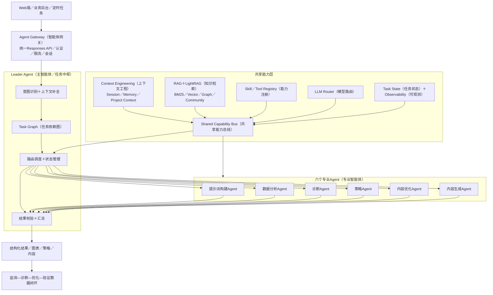

### 整体运行逻辑

1. **统一接入：**所有请求进入统一接口，系统识别项目、用户、Session和任务类型。
2. **任务编排：**Leader将复杂需求拆成Task Graph，并根据依赖关系决定Agent的串行、并行和重试顺序。
3. **专业执行：**六个Agent分别完成Prompt生产、数据分析、问题诊断、策略制定、内容生成和内容优化。
4. **上下文共享：**Agent共享项目级品牌资料、监测结果和证据，但各自的Workspace、Skill和Tool权限相互隔离。
5. **校验闭环：**结果通过Schema、事实、评分和安全校验后输出；未通过时回到对应节点补充数据或重新执行。

### 技术实现原则

| 能力 | 项目中的实现 |
|-|-|
| 统一调用 | 通过Responses API接入，使用metadata标识Agent，系统自动注入project_id和user_id。 |
| 执行模式 | 复杂推理走AgentLoop；指标计算、抓取和格式转换等确定性任务直接调用Tool。 |
| 上下文工程 | 短期状态放Session，长期知识放LightRAG与业务库，按任务只召回必要证据。 |
| 可控性 | 使用结构化输入输出、权限隔离、超时重试、日志追踪和人工审核节点。 |

### 运行时技术架构

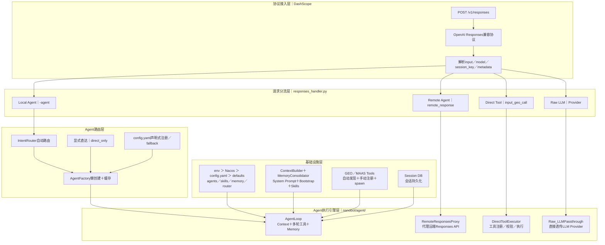

| 架构／技术 | 负责什么 | 为什么采用 |
|-|-|-|
| Responses API（统一响应接口） | 作为系统唯一入口，把用户对话、Agent任务、工具调用和普通模型请求封装成同一种请求格式，并接收流式或结构化结果。 | 前端和业务系统只需要接入一次，就能使用多轮对话、Agent、Tool和不同模型；后续新增能力不需要重新设计接口。 |
| Request Parser（请求解析器） | 从请求中解析用户输入、目标模型、会话编号和Agent名称，再生成系统内部统一的任务对象并交给分流层。 | 先把外部请求标准化，后面的路由和执行组件就不需要理解多种输入格式，能够减少接口耦合。 |
| Four-way Routing（四路分流架构） | 根据请求特征选择Local Agent（本地智能体）、Remote Agent（远程智能体）、Direct Tool（直接工具）或Raw LLM（原始模型调用）。 | 诊断和策略等复杂任务进入AgentLoop；指标计算等确定性任务直接调用Tool，可以同时兼顾能力、速度和成本。 |
| Runtime Router（运行时路由器） | 接收分流后的Agent任务，根据显式Agent名称或任务意图选择执行者，再把任务交给对应的AgentLoop或远程Agent。 | 把任务分配逻辑集中管理，Leader和业务代码不需要写死每个Agent的调用方式。 |
| Agent Registry（Agent注册中心） | 保存每个Agent的名称、职责、模型、Skill、Tool、权限和路由配置，并向Runtime Router提供可选择的Agent清单。 | 新增、替换或下线Agent时主要调整注册配置，不需要改动路由和主业务流程。 |
| AgentLoop（智能体执行循环） | 模型先判断下一步是否需要工具；工具返回结果后重新注入上下文，模型继续判断，直到形成结果或达到轮次、超时等终止条件。 | 诊断、策略等任务无法靠一次模型调用完成，执行循环能够支持多步骤推理、多工具调用和失败重试。 |
| ContextBuilder（上下文构建器） | 按当前任务组装System Prompt（系统指令）、Skill（技能说明）、Memory（记忆）、项目资料和RAG检索证据，再交给模型。 | 只注入当前任务必要的信息，既保持品牌和项目上下文连续，又避免上下文过长和不同项目数据混用。 |
| ToolRegistry（工具注册中心） | 管理抓取、计算、检索和提交结果等工具，执行白名单检查、参数转换、格式校验以及允许的并行调用。 | 把确定性工作交给代码工具，而不是让模型猜测；同时通过权限和参数校验控制Agent可以执行的操作。 |
| LLM Provider Router（大模型路由器） | 根据Agent配置和任务要求选择底层大模型，并统一处理模型参数、重试、流式输出和结构化输出。 | 业务Agent不绑定单一模型，可以根据效果、速度和成本切换模型，也便于后续升级。 |
| SessionManager（会话管理器） | 保存多轮对话、previous response、跨Agent任务状态和中间结果，并在后续请求中恢复当前会话。 | 用户不用重复描述上下文，多个Agent也能围绕同一个任务连续协作。 |
| Workspace Isolation（工作空间隔离） | 为每个Agent和项目隔离可访问的知识、Memory、Skill、Tool及文件范围。 | 防止不同Agent或不同项目互相污染数据，也便于实施最小权限控制。 |
| JSON Schema（结构化格式校验） | 检查输出是否包含规定字段、数据类型、枚举值和嵌套结构；不符合时要求模型修正或使用格式化兜底。 | 保证看板、报告和下游Agent可以稳定读取结果，避免模型输出格式漂移。 |
| Safety Check（安全检测） | 在结果返回前检查违法违规、敏感内容、危险指令和不允许发布的表达，命中风险时阻断或降级。 | 结构正确不代表内容安全，需要独立安全层控制平台和品牌风险。 |


## Leader Agent

> 📌 **产品定位：**Leader Agent是任务中枢，不直接替代专业Agent工作，而是负责理解用户目标、补全上下文、拆解任务、选择执行路径、跟踪状态并汇总结果。


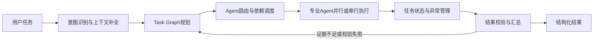

### 内部模块

| 模块 | 作用 |
|-|-|
| 意图识别器 | 识别用户是在监测、分析、诊断、制定策略、生成内容还是优化文章，并提取平台、时间和对象。 |
| 上下文补全器 | 从Session和项目知识中补齐品牌、产品、竞品、历史任务与用户约束。 |
| Task Graph规划器 | 把目标拆成带依赖关系的任务节点，例如“先分析，再诊断，最后生成策略”。 |
| Agent路由器 | 根据任务类型、能力、成本和实时状态选择专业Agent、Skill或Tool。 |
| 状态管理器 | 记录节点的待执行、进行中、成功、失败和重试状态，支持断点续跑。 |
| 校验与汇总器 | 检查结果是否完整、相互一致且有证据，并合并为用户可理解的答案或报告。 |

**输入：**用户目标、项目上下文、权限和历史会话。　**输出：**Task Graph、执行状态和结构化最终结果。

**边界：**Leader不直接计算指标、诊断文章或撰写内容；它只负责调度和验收，避免一个大模型承担所有工作而出现职责混乱。

### 采用的技术架构

Leader采用**Planner–Router–Executor–Judge（规划、路由、执行、校验）**编排架构，以Task Graph（任务依赖图）描述任务关系，以Task State Machine（任务状态机）跟踪执行过程。

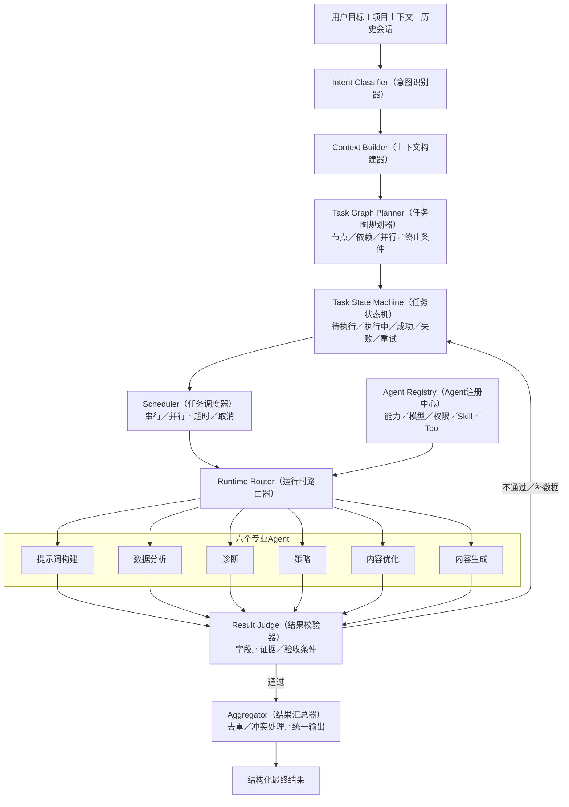

| 架构／技术 | 负责什么 | 为什么采用 |
|-|-|-|
| Planner–Router–Executor–Judge（规划、路由、执行、校验架构） | 先理解目标并生成任务计划，再选择Agent执行，最后检查并汇总结果；它是Leader整体的工作框架。 | 把“想清楚、找人做、跟踪执行、验收结果”拆开，避免Leader既做专业任务又负责调度而职责混乱。 |
| Intent Classifier（意图识别器） | 识别用户要做监测、分析、诊断、策略、生成还是优化，并抽取品牌、平台、时间和输出形式。 | 只有先确定任务类型和关键参数，才能正确选择专业Agent，减少误路由。 |
| Context Builder（上下文构建器） | 从Session、Memory和项目知识中补充品牌、产品、竞品、历史任务与用户约束，形成本次任务上下文。 | 用户不需要每次重复上传资料，同时保证各Agent基于同一项目事实工作。 |
| Task Graph Planner（任务图规划器，编排层设计） | 把复杂目标拆成多个任务节点，并标记先后依赖、可并行节点、输入输出和终止条件，例如先分析、再诊断、最后生成策略。 | 相比固定流程，任务图能根据用户目标动态组合Agent，也能表示并行和依赖关系。该部分属于编排层设计，不绑定具体框架。 |
| Task State Machine（任务状态机，编排层设计） | 记录每个节点处于待执行、执行中、成功、失败还是重试，并保存中间结果和错误原因。 | 使长任务可追踪、可恢复；某个节点失败时只重跑对应部分，不需要整条链路重新开始。 |
| Scheduler（任务调度器） | 根据任务图决定串行、并行、重试、超时和取消，并把可运行节点交给Runtime Router。 | 控制执行顺序和资源使用，避免依赖数据尚未生成就提前调用下游Agent。 |
| Runtime Router（运行时路由器） | 接收Task Graph中已经可以执行的节点，根据任务类型和能力要求选择专业Agent、Skill或Tool。 | Leader只描述“需要什么能力”，不需要了解每个Agent的具体调用地址和实现细节。 |
| Agent Registry（Agent注册中心） | 向路由器提供Agent能力说明、模型、权限、Skill、Tool和运行配置，并管理Agent的注册与下线。 | 新增或替换Agent时不需要修改Leader的规划逻辑，降低模块之间的耦合。 |
| Result Judge（结果校验器） | 逐项检查子任务是否完成、字段是否齐全、结论是否有证据，以及输出是否满足验收条件。 | 避免失败或不完整结果直接进入最终报告，并决定是否需要重试或补充数据。 |
| Aggregator（结果汇总器） | 将已经通过校验的多个Agent结果合并，处理重复信息和结论冲突，形成统一回答或报告。 | 防止简单拼接造成前后矛盾，让最终结果保持结构完整和表达一致。 |


## Prompt Agent

> 📌 **产品定位：**提示词构建Agent负责把企业资料和真实用户需求转成可长期监测的Prompt资产，并通过多平台实测持续淘汰低价值问题。


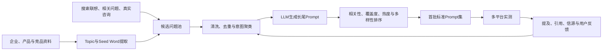

### 核心模块与实现

| 模块 | 怎么做 |
|-|-|
| 主题抽取 | 从企业、产品和竞品知识中抽取Topic、Seed Word、卖点、场景与目标人群。 |
| 查询扩展 | 结合公开搜索联想、相关问题、客户咨询和竞品研究扩展真实问法。 |
| 清洗聚类 | 去除无关、重复和歧义问题，再用Embedding与聚类归纳认知、对比、推荐、决策等意图。 |
| 生成与排序 | LLM生成长尾Prompt，并按相关性、意图匹配、主题覆盖、新鲜度和热度重排，用MMR控制重复。 |
| 反馈学习 | 把用户采纳、修改、拒绝，以及后续提及率、引用率和信源率作为反馈，持续调整Prompt池。 |

**输入：**企业资料、产品与竞品信息、搜索与咨询线索、历史监测结果。　**输出：**分类后的标准Prompt集、来源、优先级与版本。

**边界：**Agent生成的是监测问题，不是操纵模型回答的诱导词；首批Prompt用于冷启动，用户仍可新增、修改和删除。

### 采用的技术架构

提示词构建采用**Offline Processing（离线数据增强）＋Online Serving（在线召回排序）＋Feedback Loop（反馈学习）**架构；标准化批量生成可通过Direct Tool（直接工具）执行，复杂交互由Leader Agent（主智能体）编排。

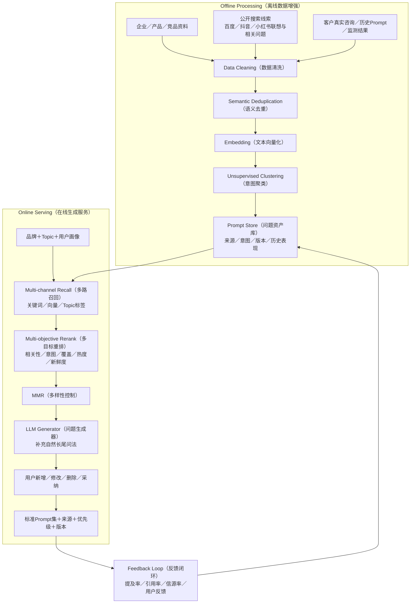

| 架构／技术 | 负责什么 | 为什么采用 |
|-|-|-|
| Offline Processing（离线数据增强） | 提前采集公共查询线索，完成清洗、向量化、意图聚类和索引构建，形成可复用的候选问题底座。 | 把耗时的数据加工放到后台执行，创建项目时不需要临时处理全量数据。 |
| Online Serving（在线生成服务） | 读取当前品牌、Topic和用户画像，从已有索引快速召回候选，完成排序、多样性控制和Prompt生成。 | 只处理本次任务相关数据，可以缩短用户等待时间并支持实时编辑。 |
| Data Cleaning（数据清洗） | 统一大小写、符号、品牌别名和字段格式，删除广告、乱码、无关内容及低质量问题。 | 先解决脏数据问题，避免错误和噪声进入聚类、召回与后续监测。 |
| Semantic Deduplication（语义去重） | 使用文本向量和相似度判断不同文字是否表达同一意图，合并近义问题并保留来源。 | 普通字符串去重识别不了改写句，语义去重能减少重复监测和指标偏差。 |
| Embedding（文本向量化） | 把Prompt转换为1024维语义向量并写入索引，使系统能够按照“意思是否相近”查找，而不只匹配相同关键词。 | 用户问法差异很大，向量表示能够识别“哪个好”和“怎么选”等语义接近但文字不同的问题。 |
| Unsupervised Clustering（无监督意图聚类） | 根据向量相似度把候选问题自动归为品牌认知、产品对比、推荐、决策和使用场景等意图簇。 | 减少人工分类成本，并用于检查每类用户意图是否被Prompt集覆盖。 |
| Multi-channel Recall（多路召回） | 同时从关键词索引、语义向量和Topic标签中获取候选Prompt，再合并、过滤和去重。 | 关键词召回准确但容易漏长尾，向量召回覆盖广但可能偏题，多路结合能兼顾准确率和覆盖率。 |
| Multi-objective Rerank（多目标重排） | 对候选Prompt综合评估品牌相关性、意图匹配、主题覆盖、热度和新鲜度，形成最终优先级。 | 相似度高不等于值得监测，多目标排序能把更有业务价值的问题排到前面。 |
| MMR（最大边际相关性） | 每选入一条Prompt，就降低与已选问题过于相似的候选权重，在相关性和多样性之间取平衡。 | 避免最终Prompt集只是同一个问题的几十种改写，让有限监测额度覆盖更多真实意图。 |
| LLM Generator（大模型问题生成器） | 结合候选问题、品牌资料、用户画像和意图缺口生成更加自然的长尾问法，并接受规则和格式约束。 | 大模型适合补充搜索数据中没有出现的新表达，但不能直接替代召回和筛选。 |
| Prompt Store（问题资产库） | 保存通过筛选的Prompt及其来源、意图分类、优先级、版本、启停状态和历史表现。 | 让Prompt可以被用户管理和持续迭代，避免每次任务都重新生成一套问题。 |
| Feedback Loop（反馈闭环） | 将用户采纳、修改、删除以及后续提及率、引用率和信源率回流到排序和Prompt池。 | 首批Prompt只能解决冷启动，必须通过真实平台表现持续淘汰低价值问题并补充新问法。 |


## 数据分析Agent

> 📌 **产品定位：**数据分析Agent把多平台原始回答转成可比较的指标、趋势和证据，回答“发生了什么、差距在哪里”，但不替代诊断Agent判断根因。


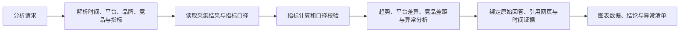

### 内部模块

| 模块 | 作用 |
|-|-|
| 参数解析器 | 抽取时间范围、AI平台、品牌、竞品、Prompt分组和指标口径。 |
| 指标计算器 | 计算Visibility Score、提及率、推荐率、引用率、TOP位置和信源分布等确定性指标。 |
| 分析引擎 | 完成趋势、平台差异、Prompt意图、竞品差距和异常波动分析。 |
| 证据绑定器 | 将结论绑定到具体Prompt、AI原始回答、引用网页、采集时间和平台。 |
| 可视化适配器 | 输出图表所需的数据结构、摘要和可下钻明细。 |

**输入：**采集数据、指标定义、分析条件。　**输出：**指标表、趋势、异常、竞品对比和对应证据。

**技术原则：**指标计算由规则和工具完成，LLM只负责理解问题与解释结果；所有结论保留口径、样本量和来源，避免“只生成一个看似合理的数字”。

### 采用的技术架构

数据分析采用**Deterministic Metric Engine（确定性指标引擎）＋LLM Insight Generator（大模型洞察生成器）**双层架构：数字由规则和公式计算，大模型只负责理解问题与解释结果。

```mermaid
flowchart LR
    RAW["多平台原始回答／引用／Prompt／时间"]
    NORMALIZE["Schema Normalizer（格式标准化器）"]
    ENTITY["Entity Extractor（实体抽取器）<br/>规则＋LLM语义识别"]
    METRIC["Deterministic Metric Engine（确定性指标引擎）<br/>提及／推荐／引用／位置／Visibility Score"]
    AGG["Multi-dimensional Aggregation（多维聚合）<br/>平台／时间／Prompt／品牌／竞品／意图"]
    ANOMALY["Anomaly Detector（异常检测器）"]
    EVIDENCE["Evidence Binder（证据绑定器）<br/>原始回答／引用网页／采集时间"]
    INSIGHT["LLM Insight Generator（洞察生成器）<br/>只解释结果，不修改数字"]
    SCHEMA["JSON Schema（结构化输出）<br/>指标／图表／趋势／异常／证据"]
    NEXT["诊断Agent／看板／GEO报告"]

    RAW --> NORMALIZE --> ENTITY --> METRIC --> AGG --> ANOMALY
    AGG --> EVIDENCE
    ANOMALY --> EVIDENCE --> INSIGHT --> SCHEMA --> NEXT

```

| 架构／技术 | 负责什么 | 为什么采用 |
|-|-|-|
| Schema Normalizer（数据格式标准化器） | 把不同AI平台返回的回答、引用链接、位置、时间和Prompt统一成固定字段，并检查空值、重复和异常数据。 | 各平台的数据结构不同，只有先统一格式，后面的指标才能使用相同口径计算和比较。 |
| Entity Extractor（实体抽取器） | 使用规则识别明确品牌名和链接，再由大模型识别品牌别名、竞品、隐式推荐、情感和回答语境，输出结构化字段。 | 纯规则难以理解语境，完全依赖模型又不够稳定；两者结合兼顾准确性和语义理解。 |
| Deterministic Metric Engine（确定性指标引擎） | 根据固定公式计算Visibility Score、提及率、推荐率、引用率、TOP位置和信源分布，不允许大模型直接估算数字。 | 保证同一批数据重复计算结果一致，指标可以审计，也便于不同平台和时间周期对比。 |
| Multi-dimensional Aggregation（多维聚合） | 按照平台、时间、Prompt、品牌、竞品和意图分组统计，并生成趋势、排名和对比所需的数据集。 | 同一份原始数据可以支持平台分析、趋势分析和竞品分析，无需为每张图重新计算。 |
| Anomaly Detector（异常检测器） | 比较当前值与历史基线，识别提及率突然下降、竞品反超、引用来源变化等异常，并记录发生范围。 | 帮助用户从大量指标中快速发现值得诊断的问题，而不是逐张图人工寻找波动。 |
| Evidence Binder（证据绑定器） | 把每个指标和异常绑定到具体Prompt、AI原始回答、引用页面、平台和采集时间，生成可下钻证据。 | 用户和诊断Agent都能复核结论来源，避免报告只有数字和结论却无法解释。 |
| LLM Insight Generator（大模型洞察生成器） | 读取已经计算好的指标和证据，归纳趋势、平台差异和竞品差距；只负责解释，不修改任何底层数字。 | 发挥大模型的语言归纳能力，同时用确定性数据边界防止模型编造指标。 |
| JSON Schema（结构化输出格式） | 统一输出指标、图表数据、洞察、异常和证据字段，供看板、报告和诊断Agent直接读取。 | 保证不同分析任务的结果格式稳定，也便于前端展示和下游自动处理。 |

## 诊断Agent

> 📌 **产品定位：**诊断Agent负责从指标异常或文章问题中寻找可验证根因，回答“为什么表现不好”，并把问题定位到平台、Prompt、信源、内容结构或可信度因素。


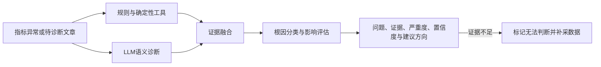

### 双路诊断架构

| 模块 | 实现方式 |
|-|-|
| 规则与工具路 | 用固定口径检查提及、排名、引用、结构、SEO、E-E-A-T、合规和可读性，保证评分可重复。 |
| LLM语义路 | 理解回答语境、竞品优势、品牌关联、引用偏好和内容深层问题，补足规则无法覆盖的语义判断。 |
| 证据融合 | 合并指标、原文片段、引用来源和规则命中项，区分事实、推断与无法判断。 |
| 根因排序 | 按影响范围、严重度、证据强度和可修复性排序，并输出置信度。 |

**输入：**指标异常、AI回答、引用网页、待分析文章和评分规则。　**输出：**问题、根因、证据、严重度、置信度及建议方向。

**边界：**诊断Agent只定位问题，不直接生成完整策略或改写文章；证据不足时必须返回“无法判断”并提出补采要求。

### 采用的技术架构

诊断采用**Rule Engine（规则与统计引擎）＋LLM-as-Judge（大模型评审器）＋Citation Preference Model（引用偏好模型）**三层架构：一期以可解释规则和大模型评审为主，引用偏好模型用于后续对齐不同AI平台的真实引用行为。

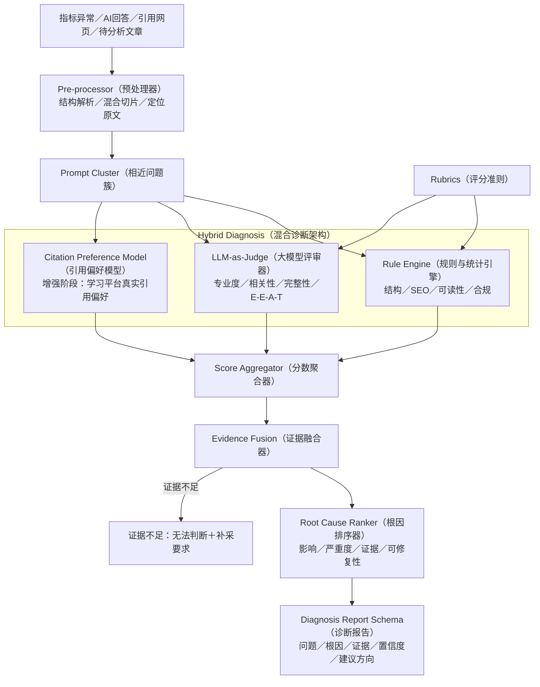

| 架构／技术 | 负责什么 | 为什么采用 |
|-|-|-|
| Hybrid Diagnosis（混合诊断架构） | 并行运行规则统计、大模型语义评审和引用偏好判断，再由聚合器合并证据与分数。 | 规则稳定但不懂深层语义，大模型理解能力强但存在随机性，混合架构能同时保证稳定和完整。 |
| Pre-processor（预处理器） | 解析网页标题、段落、FAQ、链接和元信息；长文先按结构与语义切片，再把相关片段交给后续诊断模块。 | 减少长上下文成本，并保证每项诊断都能定位到具体原文位置。 |
| Prompt Cluster（相近问题簇） | 围绕目标Prompt召回意图相近的问题和上下文，让诊断判断文章是否覆盖一组真实用户需求。 | 内容优化不能只服务一个孤立问题，应尽量提升同类问题下的整体引用机会。 |
| Rule Engine（规则与统计引擎） | 按固定规则检查标题层级、段落长度、FAQ、关键词、SEO、可读性、合规和结构完整性，并记录命中位置。 | 这些项目可以确定性计算，使用规则能够保证评分可重复、可解释和低成本。 |
| LLM-as-Judge（大模型评审器） | 读取目标Prompt、网页片段和诊断上下文，理解专业深度、语义匹配与表达质量，并返回逐项判断、理由和原文证据。 | 这些语义问题很难由固定规则覆盖，需要大模型理解上下文和用户意图。 |
| Rubrics（评分准则） | 定义权威性、相关性、完整性、时效性和可引用性等评审维度，以及每个分档的判断条件。 | 给大模型明确的评分边界，使不同文章和不同批次的诊断尽量保持同一口径。 |
| Citation Preference Model（引用偏好模型，增强能力） | 使用真实的已引用和未引用页面作为偏好样本，学习不同平台更倾向引用哪类内容，并输出偏好差距。 | AI平台内部规则不可见，只能通过真实引用行为逐步对齐。该模型属于增强阶段，不与一期规则诊断混写。 |
| Score Aggregator（分数聚合器） | 合并规则评分、大模型评分和偏好模型结果，处理量纲差异与冲突，生成最终维度分数和置信度。 | 降低单次大模型打分的波动，并让多个诊断通道形成统一结果。 |
| Evidence Fusion（证据融合器） | 将规则命中位置、模型引用的原文片段、指标数据和引用来源绑定到对应诊断结论。 | 分数本身不能解释问题，证据融合让用户能够查看每个判断的依据。 |
| Root Cause Ranker（根因排序器） | 根据影响范围、严重度、证据强度和可修复性排列问题，区分主要根因与次要现象。 | 帮助策略Agent优先处理真正影响提及和引用结果的问题。 |
| Diagnosis Report Schema（诊断报告格式） | 规定诊断报告必须输出问题、维度分数、根因、证据、严重度、置信度和建议方向。 | 保证前端、策略Agent和内容优化Agent能够稳定读取诊断结果。 |


## 策略Agent

> 📌 **产品定位：**策略Agent把“哪里有问题、为什么有问题”转成“先做什么、谁来做、做到什么程度”，是诊断结果到执行任务之间的决策层。


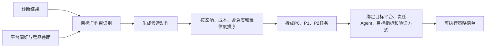

### 内部模块与决策逻辑

| 模块 | 作用 |
|-|-|
| 目标约束解析器 | 识别目标平台、业务阶段、资源预算、发布时间和不能触碰的品牌与合规边界。 |
| 机会识别器 | 结合诊断根因、平台偏好、竞品差距和Prompt覆盖找到可提升机会。 |
| 动作生成器 | 形成补知识、改Prompt、调内容结构、强化证据、扩展信源等候选动作。 |
| 优先级引擎 | 综合预期影响、执行成本、紧急度和置信度，排序为P0、P1、P2。 |
| 任务编译器 | 把策略转成责任Agent可执行的任务，绑定目标指标、验收标准和复测周期。 |

**输入：**分析结论、诊断根因、平台偏好、竞品表现和业务目标。　**输出：**有优先级的策略清单、责任Agent、目标指标与验证方式。

**边界：**策略Agent不直接写文章，也不凭经验给泛化建议；每项策略必须回答目标平台、执行原因、动作内容和如何验证。

### 采用的技术架构

策略Agent采用**LLM Generator（大模型策略生成器）＋Rule-based Decision（规则化多目标决策）＋Task Compiler（任务编译器）**架构，大模型负责生成候选方案，规则负责排序、校验和任务化。

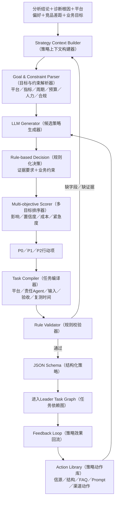

| 架构／技术 | 负责什么 | 为什么采用 |
|-|-|-|
| LLM Generation（大模型候选生成） | 基于诊断、归因、竞品差距和业务目标生成多种候选策略，并说明每项动作的目标和理由。 | 适合处理不同品牌和场景下的策略组合，补足固定规则无法枚举的情况。 |
| Rule-based Decision（规则化决策） | 使用证据要求、业务约束和优先级规则筛选候选策略，删除不可执行或与目标冲突的动作。 | 限制大模型发散范围，使最终策略可执行、可校验，而不是停留在创意层面。 |
| Strategy Context Builder（策略上下文构建器） | 统一读取品牌画像、指标问题、归因因素、平台偏好、竞品差距、业务优先级和资源约束。 | 保证所有策略基于完整且一致的证据，而不是只看某一个低分指标。 |
| Goal & Constraint Parser（目标与约束解析器） | 提取目标平台、目标指标、周期、预算、人力、渠道和合规边界，形成策略生成的硬约束。 | 同一个问题在不同预算和业务阶段下解法不同，先明确约束才能生成可落地策略。 |
| Action Library（策略动作库） | 沉淀补充权威信源、调整内容结构、增加FAQ、扩展Prompt覆盖和优化渠道分发等标准动作，并记录适用条件和责任Agent。 | 为大模型提供经过业务验证的动作范围，减少空泛建议，也便于统一执行和复用。 |
| LLM Generator（大模型策略生成器） | 结合策略上下文，从动作库中选择、组合并补充候选动作，说明目标平台、执行原因和预期影响。 | 规则库无法覆盖所有品牌情况，大模型能够根据上下文灵活组合，但仍受证据和动作库约束。 |
| Multi-objective Scorer（多目标排序器） | 综合评估候选动作的预期影响、证据置信度、执行成本和紧急程度，再形成P0、P1、P2优先级。 | 使策略排序有统一依据，但不虚构未经校准的固定公式和权重。 |
| Task Compiler（任务编译器） | 把策略转换成Leader可执行的任务，明确目标平台、目标指标、责任Agent、所需输入、验收条件和复测时间。 | 将“建议”变成可以直接进入Task Graph的工作项，减少人工二次拆解。 |
| Rule Validator（规则校验器） | 检查每项策略是否有证据、目标平台、执行原因、责任Agent、目标指标和验证方式；缺失时退回补充。 | 保证策略不是泛化建议，并在进入执行链路前完成业务验收。 |
| JSON Schema（结构化格式） | 规定策略摘要、P0/P1/P2行动项、目标因素、目标指标、置信度、风险和下一步等字段。 | 让Leader、前端路线图和任务系统能够直接读取策略结果。 |
| Feedback Loop（策略反馈闭环） | 在执行后读取复测指标和效果变化，记录哪些动作有效，并作为下一轮排序参考。 | 让策略从一次性建议变成可持续迭代的决策资产。 |

## 内容优化Agent

> 📌 **产品定位：**内容优化Agent面向已有文章，根据诊断结果做有依据的局部改写，并在保留原意和正确事实的前提下提升可读、可检索、可引用和可发布性。


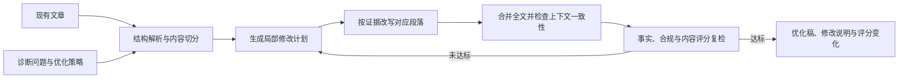

### 内部模块

| 模块 | 作用 |
|-|-|
| 预处理器 | 解析标题、段落、FAQ、表格、链接和已有证据，建立可修改的文档结构。 |
| 优化规划器 | 把诊断问题映射到具体段落和修改动作，控制改动范围与优先级。 |
| 局部生成器 | 只改有证据支撑的部分，例如补量化信息、调整问答结构、强化来源或消除夸大表达。 |
| 全文整合器 | 处理段落衔接、术语一致、重复信息、标题层级和上下文冲突。 |
| Judge复评器 | 复查事实、合规、E-E-A-T、结构和内容评分，不达标则回到规划器迭代。 |

**输入：**原文、诊断问题、优化策略、品牌知识和渠道规范。　**输出：**优化稿、逐项修改说明、引用依据及优化前后评分。

**边界：**不为提高分数编造事实，不无依据重写正确内容；重大事实缺失或高风险修改进入人工审核。

### 采用的技术架构

内容优化采用**Iterative Refinement（迭代优化）**架构，以Planner（优化规划器）、Generator（段落生成器）、Integrator（全文整合器）和Judge（内容复评器）形成可控的局部修改闭环。

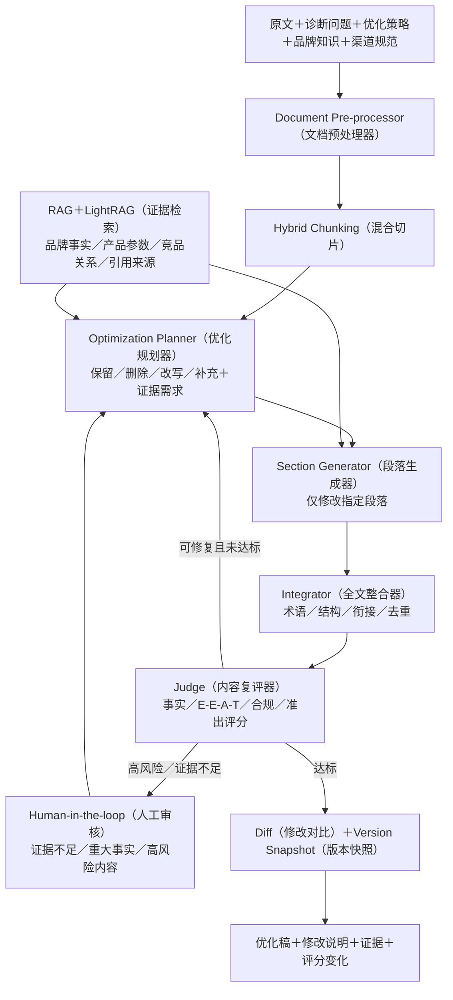

| 架构／技术 | 负责什么 | 为什么采用 |
|-|-|-|
| Iterative Refinement（迭代优化架构） | 按“诊断、规划、局部改写、全文整合、复评”循环执行；达到准出门槛、超过迭代次数或需要人工确认时停止。 | 文章问题通常无法一次修完，迭代架构能够逐步修正，同时用停止条件控制模型成本和死循环。 |
| Document Pre-processor（文档预处理器） | 解析标题、段落、FAQ、表格、链接和已有证据，建立段落编号及前后关系，供后续模块精确定位。 | 没有结构化文档表示，模型只能整篇重写，容易误改本来正确的内容。 |
| Hybrid Chunking（混合切片） | 先按标题、段落和语义边界切片，再使用Token上限控制长度，并在边界保留少量上下文。 | 兼顾语义完整性与模型上下文限制，减少一句话被截断或跨段信息丢失。 |
| LightRAG（图谱增强检索架构） | 根据当前段落和诊断问题召回品牌事实、产品参数、案例、竞品关系和被引页面，并保留来源。 | 改写内容必须有证据；图谱与文本联合召回比单纯相似文本更适合处理品牌和产品关系。 |
| Optimization Planner（优化规划器） | 把诊断问题映射到具体段落，判断应保留、删除、改写还是补充，并列出每项修改需要的证据。 | 先规划修改范围可以防止Generator为了提高分数大面积重写文章。 |
| Section Generator（段落生成器） | 根据修改计划和召回证据，只改指定段落，并保留未被诊断为问题的正确内容。 | 局部生成更容易控制事实和成本，也便于展示修改前后差异。 |
| Integrator（全文整合器） | 将修改段落放回全文，检查术语、上下文、标题层级、段落衔接和重复信息。 | 单个段落写得正确不代表整篇文章连贯，需要独立整合步骤处理全局一致性。 |
| Judge（内容复评器） | 重新检查事实、评分准则、E-E-A-T、合规和准出分；可修复问题返回Planner继续迭代。 | 保证优化稿不是“改完就发”，并用统一门槛判断是否达到发布标准。 |
| Human-in-the-loop（人工审核） | 接收证据不足、企业关键信息、重大改写和合规高风险内容，由用户确认、补充或驳回。 | 模型不能替企业确认事实和风险，关键内容需要保留人工决策权。 |
| Diff（修改对比） | 逐段展示优化前后文本、修改位置、修改原因和使用证据。 | 让用户快速理解系统改了什么，也便于审核是否误改原意。 |
| Version Snapshot（版本快照） | 保存原文、优化稿、诊断分数、策略、模型版本和时间，支持历史比较与回滚。 | 便于复盘哪一轮优化有效，也能在结果不理想时恢复旧版本。 |

## 内容生成Agent

> 📌 **产品定位：**内容生成Agent面向从0到1创作，把主题和策略Brief转成结构化、可信、适合目标渠道且满足GEO准出标准的文章。


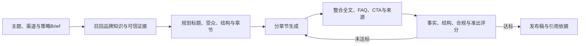

### 内部模块

| 模块 | 作用 |
|-|-|
| Brief解析器 | 提取主题、受众、目标平台、核心信息、篇幅、语气和CTA等约束。 |
| 证据召回器 | 从LightRAG召回必要的品牌事实、产品参数、案例和来源，避免无边界生成。 |
| 内容规划器 | 先产出标题与4—6章JSON大纲，定义每章目标、证据、FAQ和CTA位置。 |
| 章节生成器 | 按大纲分段生成，事实仅来自用户资料和知识库；证据不足时保留待补项。 |
| 整合与校验器 | 统一术语与上下文，检查结构、事实、SEO、E-E-A-T、合规和可读性，并触发准出评分。 |

**输入：**主题、策略Brief、品牌资料、目标平台和内容规范。　**输出：**完整发布稿、结构化元数据、引用依据和准出评分。

**边界：**不编造企业事实、数据或案例；若证据不足则明确缺口并进入人工补充，而不是强行补全。

### 采用的技术架构

内容生成采用**Plan-and-Write（先规划后生成）＋RAG Grounding（检索证据约束）＋Judge（内容评审器）准出**架构，先规划文章结构，再按证据分段生成，最后统一整合和校验。

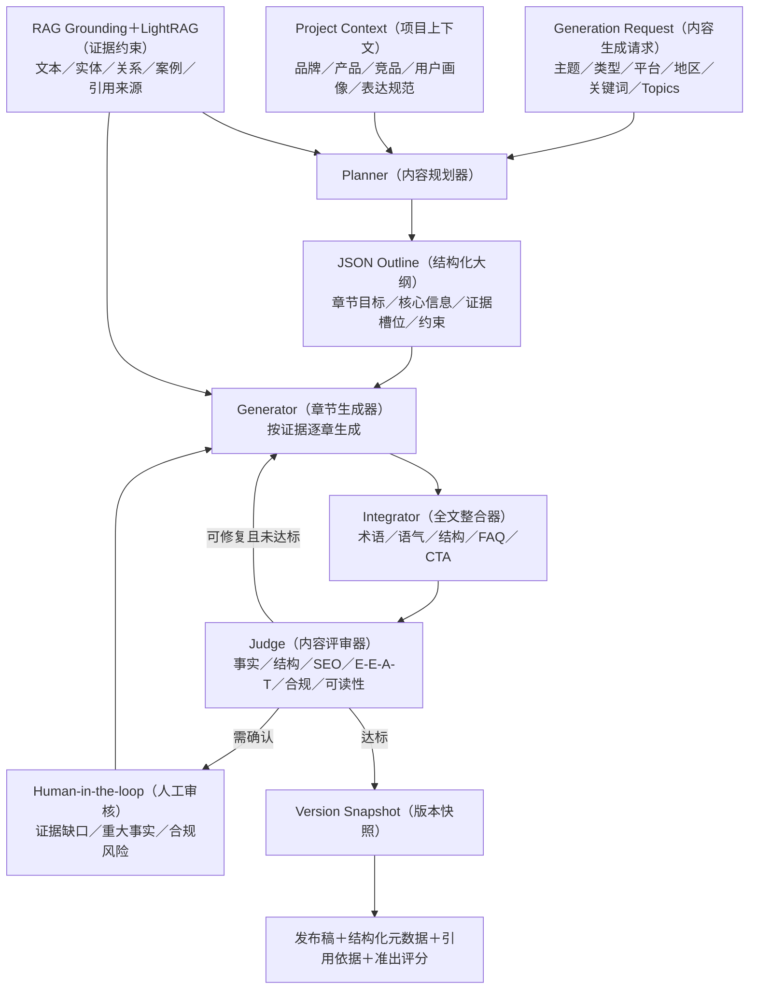

| 架构／技术 | 负责什么 | 为什么采用 |
|-|-|-|
| Plan-and-Write（先规划后生成） | 先生成文章大纲和章节任务，再逐章写作、整合和校验，而不是一次性生成完整长文。 | 能够提前检查结构和信息覆盖，减少长文遗漏、重复与内容漂移。 |
| RAG Grounding（检索证据约束） | 在生成每个章节前召回对应事实和来源，并要求生成内容限定在这些证据和用户材料范围内。 | 减少模型凭常识补写或编造，让关键事实能够追溯到来源。 |
| Generation Request（内容生成请求） | 接收用户需求、内容类型、用户材料、参考策略、地区、关键词和Topics等本次写作参数。 | 把一次内容任务的目标和限制结构化，便于校验必填信息及生成结果。 |
| Project Context（项目上下文） | 提供当前项目的品牌、产品、竞品、用户画像、表达规范和已有知识，并按权限过滤。 | 保证多轮创作保持品牌一致，也防止不同项目之间的数据混用。Content Brief和Brand Content Pack属于后续扩展方案。 |
| LightRAG（图谱增强检索架构） | 围绕主题同时召回相关文本、品牌与产品实体、竞品关系、案例和引用来源，并进行过滤、去重和证据保留。 | 内容生成不仅需要相似文字，还需要正确理解品牌、产品和竞品之间的关系。 |
| Planner（内容规划器） | 根据主题、目标平台和检索证据决定文章结构、章节顺序、信息重点及FAQ和CTA位置。 | 把内容组织和正文写作分开，便于在生成前检查结构是否覆盖用户需求。 |
| JSON Outline（结构化大纲） | 使用JSON记录4—6个章节及每章目标、核心信息、证据槽位和写作约束，供Generator逐节点执行。 | 机器可以稳定读取和校验大纲，也便于用户编辑后再继续生成。 |
| Generator（章节生成器） | 每次只生成一个大纲节点，使用对应证据和写作约束；资料不足时输出缺口，不允许调用模型常识强行补全。 | 缩短单轮上下文，提升段落聚焦度，并降低事实编造风险。 |
| Integrator（全文整合器） | 合并所有章节，统一品牌名、产品术语、语气和标题层级，并检查章节衔接、FAQ和CTA。 | 分段生成可能出现重复或前后不一致，需要单独进行全局整合。 |
| Judge（内容评审器） | 按照事实准确性、结构、SEO、E-E-A-T、用户价值、合规和可读性逐项复评；可修复问题退回对应章节。 | 生成完成不等于达到发布标准，通过准出评分把质量要求变成可执行门槛。 |
| Human-in-the-loop（人工审核） | 证据不足、重大企业事实或合规风险进入人工补充和确认，通过后才能进入发布稿。 | 模型不能替企业确认关键事实，必须为高风险内容设置人工控制点。 |
| Version Snapshot（版本快照） | 保存生成请求、项目上下文、模型版本、引用证据、评分和文章版本。 | 使文章能够追溯、比较和回滚，也便于后续复盘生成质量。 |

## 品牌诊断Agent

> 📌 **产品定位：**品牌诊断不是一次普通的模型调用，而是由 Brand Diagnosis Main Agent（品牌诊断主智能体）编排的异步任务链。它先补齐品牌、竞品和监测问题，待用户确认后并行采集多平台AI回答并完成诊断，最终生成可见性指标、问题证据和优化建议。


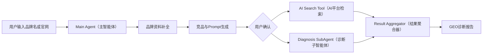

### 内部模块与运行逻辑

| 模块 | 作用 |
|-|-|
| Brand Diagnosis Main Agent（品牌诊断主智能体） | 理解诊断目标，依次调度品牌资料和Prompt生成，并在用户确认后并行启动AI检索与诊断任务。 |
| Brand Profile SubAgent（品牌资料子智能体） | 根据品牌名称或官网补齐品牌介绍、识别词、核心产品和主要竞品，形成诊断对象的基础档案。 |
| Prompt SubAgent（问题生成子智能体） | 围绕品牌认知、产品功能、购买决策、对比评估和使用场景生成监测问题，并允许用户增删和修改。 |
| AI Search Tool（AI平台检索工具） | 用确认后的同一套Prompt并行查询豆包、元宝、Kimi、DeepSeek等平台，保存完整回答、品牌提及、竞品和引用来源。 |
| Diagnosis SubAgent（诊断子智能体） | 根据回答、引用和品牌资料计算表现指标，识别情感、事实准确性、可信度及口碑等问题，并输出证据和建议。 |
| Result Aggregator（结果聚合器） | 等待AI检索与诊断两个分支完成，统一处理重复数据和口径差异，生成平台表现、综合结论和报告数据。 |

**输入：**品牌名称或官网地址、目标AI平台和用户确认后的Prompt。　**输出：**品牌可见性指标、平台差异、AI回答与引用证据、诊断结论和优化建议。

**边界：**本章说明诊断任务如何运行；具体品牌曝光评分公式仍放在“评分规则—品牌诊断评分”章节，避免业务链路与评分口径重复。

### 采用的技术架构

品牌诊断采用 **Orchestrated Agent Workflow（智能体编排工作流）**，以 Task State Machine（任务状态机）管理草稿补全与正式诊断，以 Parallel Execution（并行执行）降低多平台采集耗时，再通过 Result Aggregator（结果聚合器）形成统一报告。

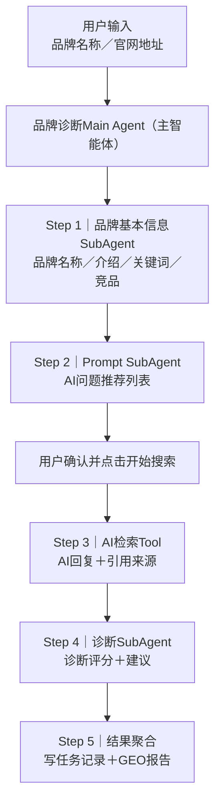

| 架构／技术 | 负责什么 | 为什么采用 |
|-|-|-|
| Orchestrated Agent Workflow（智能体编排工作流） | 把资料补全、问题生成、平台采集、诊断和报告聚合拆成可独立执行的任务节点。 | 不同步骤使用的数据和能力不同，拆分后更容易扩展平台、替换模型并定位失败环节。 |
| Main Agent（主智能体） | 读取用户输入和当前任务状态，决定下一步调用哪个子智能体或工具，并检查依赖是否满足。 | 让前端只面对一个任务入口，不需要了解内部多个Agent和接口的调用顺序。 |
| Task State Machine（任务状态机） | 管理 INIT、INFO_COLLECTING、INFO_COLLECT_COMPLETED、PENDING、RUNNING、COMPLETED和FAILED等状态。 | 诊断任务耗时较长，状态机可支持轮询、失败重试、进度展示和断点恢复。 |
| Task Queue（任务队列） | 接收正式提交后的多平台采集和诊断任务，控制并发、重试、超时和失败补偿。 | 避免长任务阻塞用户请求，并防止瞬时并发过高导致平台调用不稳定。 |
| Parallel Execution（并行执行） | 在Prompt确认后同时执行各AI平台查询，并让AI检索与诊断分支并行运行。 | 各平台之间没有前置依赖，并行可以显著缩短整份诊断报告的等待时间。 |
| Idempotency Control（幂等控制） | 使用同一个taskId贯穿草稿和正式任务，并拒绝PENDING、RUNNING或COMPLETED任务重复提交。 | 防止用户重复点击产生两份采集任务、重复扣费或覆盖已有结果。 |
| Task Query Store（问题明细存储） | 按“一个Prompt×一个AI平台”保存执行状态、回答、提及、竞品、引用和错误信息。 | 既支持平台级统计，也能回溯某个分数对应的原始回答和引用证据。 |
| Result Aggregator（结果聚合器） | 等待所有必要分支完成，将问题级数据汇总为平台指标、品牌总览和诊断建议。 | 统一计算口径，避免各子智能体直接拼接结果造成重复、缺失或前后矛盾。 |
| Report Schema（报告结构） | 规定报告必须输出综合分、维度分、平台表现、问题证据、样本量、时间和优化建议。 | 让前端稳定渲染，也保证报告不是只有一个无法解释的总分。 |

# AI底层支持能力

> 🧠 **能力定位：**AI底层支持能力不是一组平行名词，而是分层协作的技术链路。RAG负责取得可信证据，LightRAG补充实体关系和全局知识，混合召回与向量召回负责在线找资料，归因引擎则在检索之外解释“为什么表现不好”，再把结论交给策略和内容Agent。


| 能力 | 所在位置 | 核心作用 |
|-|-|-|
| RAG（检索增强生成） | 知识建设与在线问答总架构 | 把企业资料、AI回答和引用网页加工为可检索证据，并在生成前提供可信上下文。 |
| LightRAG（图谱增强检索） | RAG中的图谱增强链路 | 补充实体、关系、多跳关联和社区级全局知识。 |
| Hybrid Recall（混合召回） | RAG在线检索层 | 融合关键词和语义召回，兼顾精确匹配与相似表达。 |
| Vector Infrastructure（向量检索基础设施） | 索引、存储与近邻搜索层 | 把文本转成向量并提供高性能相似度搜索。 |
| Vector Recall（向量召回） | 在线查询执行过程 | 将Query向量化并返回语义最相近的Top K片段。 |
| Attribution Engine（归因引擎） | 数据分析、诊断与策略之间 | 关联指标差距、影响因子和证据，解释问题原因并生成动作方向。 |

## RAG架构

> 📌 **产品定位：**RAG把企业资料、AI回答和引用网页从一次性上下文变成项目级知识资产。新建项目时先完成首次采集和入库，后续Agent优先从知识库召回，只有资料缺失、过期或任务要求实时信息时才补充外部搜索；其中关键词与向量通道由RecallService统一编排，实体关系、社区和多跳查询由LightRAG承担。


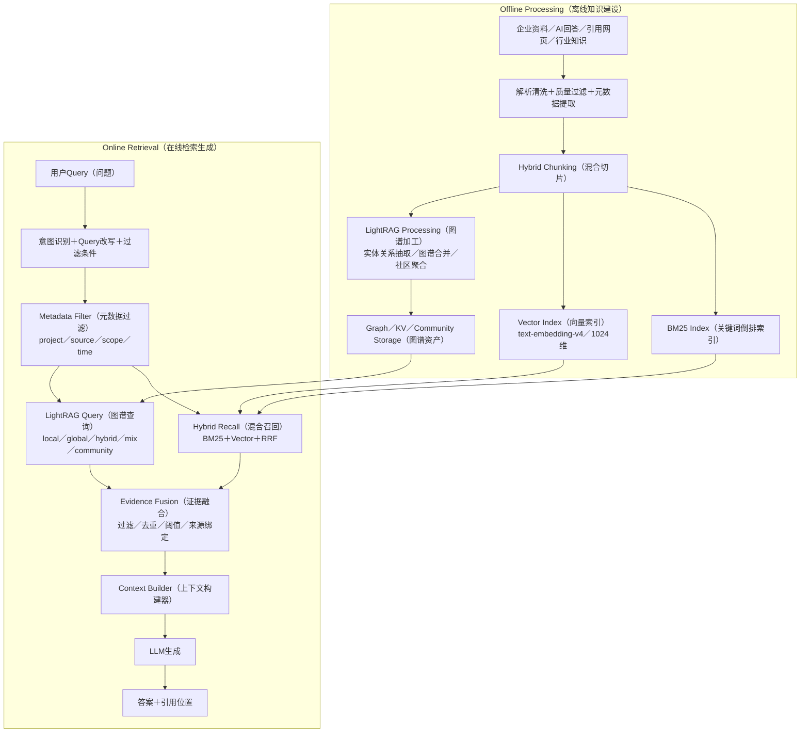

### 内部模块与运行逻辑

| 模块 | 作用 |
|-|-|
| Source Connector（数据接入器） | 接收用户上传文件、企业资料、AI回答、引用网页和后续补充的行业知识。 |
| Data Cleaning（数据清洗） | 解析正文，移除导航、广告和乱码，完成URL归一、重复检测、质量过滤和敏感信息检查。 |
| Hybrid Chunker（混合切片器） | 先按标题、段落和语义边界拆分，再用Token限制最大长度并保留少量上下文重叠。 |
| Metadata Extractor（元数据提取器） | 提取项目、来源、标题、URL、主题、语言、时间和Chunk位置，支持过滤和引用回链。 |
| Index Builder（索引构建器） | 为同一批Chunk建立关键词倒排索引、向量索引，并通过LightRAG构建实体关系图谱、社区报告和来源映射。 |
| Query Rewriter（查询改写器） | 识别用户意图、品牌和主题，将口语问题改写成更适合检索的Query，并推导过滤条件。 |
| Recall Orchestrator（召回编排器） | 按照任务类型选择BM25、向量、图谱或混合策略，控制Top K、阈值、去重和融合。 |
| Evidence Builder（证据构建器） | 将候选片段整理成带来源、位置和用途标记的上下文，交给大模型生成。 |

**输入：**项目知识、AI回答、引用网页和用户Query。　**输出：**与问题相关的证据片段、来源位置及基于证据生成的回答。

**边界：**RAG负责“找到并组织证据”，不替代业务Agent做指标计算、归因判断或最终策略决策。

### 采用的技术架构

系统采用 **Offline–Online RAG（离线建设、在线检索架构）**。离线侧持续加工知识，在线侧通过统一 RecallService（召回服务）并行调用 Hybrid Recall（混合召回）和 LightRAG Query API（图谱查询接口），再以项目级 Metadata Filter（元数据过滤）保证客户数据隔离。

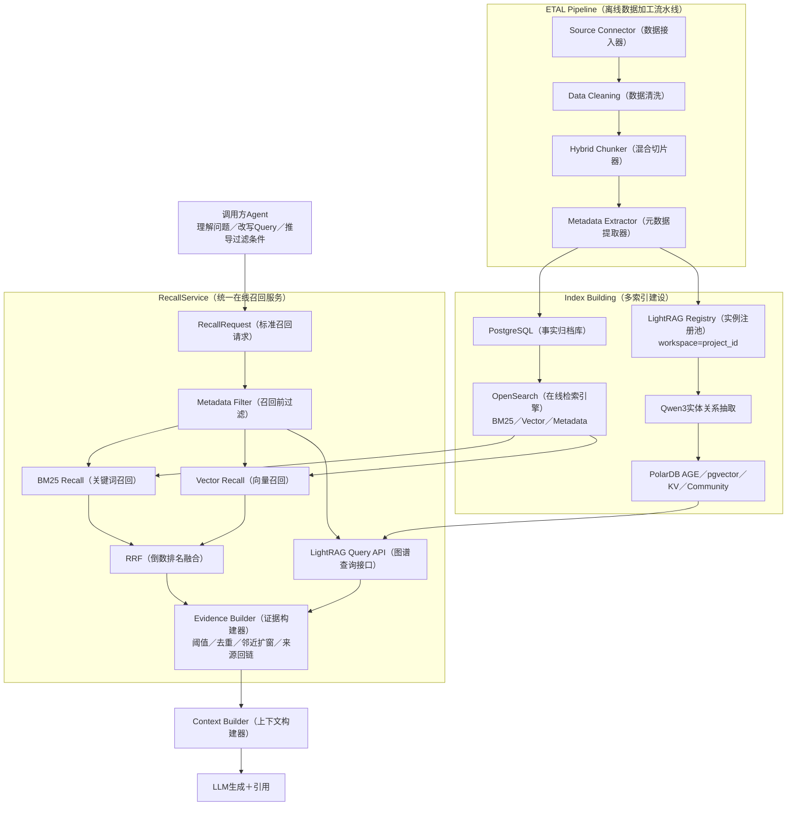

| 架构／技术 | 负责什么 | 为什么采用 |
|-|-|-|
| Offline–Online RAG（离线建设、在线检索架构） | 离线完成数据加工和索引，在线只做Query处理、召回、证据组装和生成。 | 把重计算前置，减少实时请求延迟，并让知识可以复用而不是每次重新搜索。 |
| RecallService（统一召回服务） | 接收标准RecallRequest，执行指定召回策略、过滤条件、Top K和返回字段。 | Agent不需要感知OpenSearch、pgvector或图数据库的内部实现，便于统一治理和替换引擎。 |
| Metadata Filter（元数据过滤） | 在召回前按project_id、source_type、scope_type、主题、语言和时间收敛候选范围。 | 既防止跨客户数据泄露，也避免无关全文和旧数据挤占召回结果。 |
| Hybrid Chunking（混合切片） | 按照文档结构和语义切分，再使用Token上限控制大小，并保留相邻片段重叠。 | 兼顾语义完整性与模型上下文成本，比单纯固定Token硬切更适合文章和企业资料。 |
| Embedding（向量化） | 使用text-embedding-v4将Chunk编码为1024维向量，支持语义相似搜索。 | 能够识别同义、近义、跨语言和长尾表达，补足关键词只能匹配字面的不足。 |
| BM25（关键词相关性算法） | 基于词频和文档长度从倒排索引中召回品牌名、产品名、数字、缩写和专有词。 | 对精确字面匹配稳定，能补足向量检索在稀有专名和数字上的漂移。 |
| Context Builder（上下文构建器） | 按证据角色组织事实资料、参考范例和图谱关系，并控制上下文长度。 | 防止把风格示例误当事实，也避免把全部原文塞入Prompt造成成本和噪声上升。 |
| Source Linker（来源回链器） | 使用source_id和chunk_index保留原文、命中片段及邻近上下文位置。 | 支持用户核验、Agent二次访问和结果审计，使答案可追溯。 |

## LightRAG图谱增强架构

> 📌 **产品定位：**LightRAG用于增强传统RAG对实体关系和全局知识的理解。它不是只负责切片，也不是独立业务服务，而是嵌入数据Pipeline的算法能力：离线把文本转成实体、关系、社区和向量资产，在线通过不同查询模式返回局部事实、多跳关系或宏观主题。


```mermaid
flowchart LR
    T["清洗后的Chunk"] --> E["Qwen3实体／关系联合抽取"] --> M["实体对齐与图谱合并"]
    M --> G["Graph Storage（图存储）"]
    M --> V["Vector Storage（向量存储）"]
    M --> K["KV Storage（原文与映射）"]
    M --> C["Community Detection（社区发现）"] --> CR["Community Report（社区报告）"]
    Q["在线Query"] --> MODE{"查询模式选择"}
    MODE --> G
    MODE --> V
    MODE --> CR
    G --> R["实体／关系／Chunk证据"]
    V --> R
    CR --> R
```

### 内部模块与运行逻辑

| 模块 | 作用 |
|-|-|
| KG Extractor（实体关系抽取器） | 使用Qwen3从Chunk中联合识别品牌、主题、AI引擎、来源、内容、人物和行业等实体及关系。 |
| Entity Resolver（实体对齐器） | 合并同名或别名实体，保留不同来源的描述、关系权重和对应Chunk。 |
| Graph Merger（图谱合并器） | 把新抽取的节点和边写入项目图谱，并同步图、向量和KV中的映射关系。 |
| Community Detector（社区发现器） | 使用Leiden算法将关系密切的实体聚成社区，识别行业主题、品牌生态和事件群。 |
| Community Reporter（社区报告生成器） | 基于社区中的核心实体和关系生成摘要、发现和可信度信息，供宏观查询使用。 |
| Query Mode Router（查询模式路由器） | 根据问题是具体实体、关系、行业趋势还是纯语义查找，选择local、global、hybrid、mix、naive或community。 |
| Graph Retriever（图谱召回器） | 从相关实体或关系出发遍历邻接节点，并回填支撑这些关系的原始Chunk。 |
| Community Retriever（社区召回器） | 召回相关社区报告，通过Map-Reduce汇总多个社区的宏观结论。 |

**输入：**项目Chunk、实体关系抽取结果和在线Query。　**输出：**实体、关系、原文Chunk、社区报告及来源映射。

**边界：**LightRAG增强关系理解和全局召回，但最终证据仍需经过权限过滤、去重和融合；它不能替代完整的RAG编排和答案生成。

### 采用的技术架构

LightRAG以算法库方式嵌入 ETAL Pipeline（数据加工流水线），通过 LightRAG Registry（实例注册池）按Workspace复用实例；GraphRAG的社区模块补充原生global模式缺少的社区聚类与Map-Reduce全局查询。

```mermaid
flowchart TB
    subgraph OFFLINE["LightRAG Processing API（离线图谱建设）"]
        INGEST["ETAL Pipeline（数据加工流水线）<br/>Chunk＋workspace＋doc_id"]
        REG["LightRAG Registry（实例注册池）<br/>processing(workspace)／LRU复用"]
        EXTRACT["KG Extractor（实体关系抽取器）<br/>Qwen3联合抽取"]
        EMB["Embedding Node（向量化节点）<br/>text-embedding-v4／1024维"]
        MERGE["Graph Merger（图谱合并器）<br/>实体对齐／节点边合并／映射同步"]
        COMMUNITY["Community Detector（社区发现器）<br/>Leiden聚类＋社区报告"]
        INGEST --> REG
        REG --> EXTRACT --> MERGE --> COMMUNITY
        REG --> EMB
    end

    subgraph STORE["Workspace隔离存储"]
        GRAPH["PolarDB AGE（图存储）<br/>每个Workspace独立图名"]
        VECTOR["pgvector（向量存储）<br/>按Workspace过滤"]
        KV["KV／DocStatus（原文与状态）"]
        REPORT["Community Report（社区报告）"]
    end

    subgraph ONLINE["LightRAG Query API（在线图谱检索）"]
        QUERY["在线Query"]
        QREG["LightRAG Registry<br/>query(workspace)"]
        MODE["Query Mode Router（查询模式路由器）<br/>local／global／hybrid／mix／naive／community"]
        GRET["Graph Retriever（图谱召回器）<br/>实体／关系／多跳／原始Chunk"]
        CRET["Community Retriever（社区召回器）<br/>Map-Reduce全局汇总"]
        RESULT["实体＋关系＋Chunk＋社区报告＋来源映射"]
        QUERY --> QREG --> MODE
        MODE --> GRET
        MODE --> CRET
        GRET --> RESULT
        CRET --> RESULT
    end

    MERGE --> GRAPH
    EMB --> VECTOR
    MERGE --> KV
    COMMUNITY --> REPORT
    GRAPH --> GRET
    VECTOR --> GRET
    KV --> GRET
    REPORT --> CRET

```

| 架构／技术 | 负责什么 | 为什么采用 |
|-|-|-|
| LightRAG（图谱增强检索框架） | 提供实体关系抽取、图谱合并、图检索、向量检索和多模式查询能力。 | 在传统向量RAG上补充关系和多跳分析，同时保留原文Chunk作为证据。 |
| ETAL Pipeline（数据加工流水线） | 把原生ainsert拆成切片、向量化、抽取和合并等独立节点，并管理重试和监控。 | 单个环节失败时可以局部重跑，也便于复用处理节点和观察质量。 |
| LightRAG Registry（实例注册池） | 根据project Workspace创建或复用LightRAG实例及社区存储，并注入项目元数据。 | 减少重复初始化成本，同时保证每个客户的数据和图谱互相隔离。 |
| Qwen3（实体关系抽取模型） | 一次从Chunk中联合抽取实体、关系和描述，并为社区摘要提供大模型能力。 | 相比只做关键词抽取，它能识别文本中隐含的品牌、产品、竞品和行业关系。 |
| PolarDB AGE（图数据库扩展） | 保存项目级节点、边和Chunk映射，并支持邻接关系和多跳图查询。 | 在PostgreSQL体系内提供图能力，降低单独维护图数据库的运维复杂度。 |
| pgvector（向量存储） | 保存Chunk、实体和关系描述向量，支持语义检索和mix模式的原文补充召回。 | 当前可与PolarDB统一部署；后续可按性能需求迁移至OpenSearch。 |
| Leiden Community Detection（Leiden社区发现） | 根据图中连接密度识别实体社区和层级结构。 | 把零散关系聚合成品牌生态和行业主题，为宏观分析提供稳定单元。 |
| Map-Reduce Global Query（分组汇总式全局查询） | 对多个高相关社区分别生成局部回答，再汇总为全局结论。 | 避免一次把整张图塞入上下文，也补足原生global只做高层关键词遍历的不足。 |
| Workspace Isolation（工作空间隔离） | 用户数据使用project_id隔离，行业公共知识按industry_code共享。 | 既防止客户数据串库，又允许公共行业知识复用。 |

## 归因引擎

> 🔎 **产品定位：**归因引擎位于数据分析、诊断和策略Agent之间，负责回答“为什么品牌提及率、推荐率或引用率变差”。它不属于RAG，而是把Metric（结果指标）、Factor（影响因子）和Evidence（原文证据）关联起来，输出主要原因、影响方向、置信度及可执行动作。


```mermaid
flowchart LR
    M["Metric异常或低于Benchmark"] --> F["候选Factor筛选"]
    F --> E["Evidence Pack（证据包）"]
    E --> J["LLM／Skill Judge（评审器）"]
    J --> R["归因排序"]
    R --> A["Action Mapping（动作映射）"]
    A --> C["Agent Context（智能体上下文）"]
    C --> X["策略／内容Agent执行"]
    X --> V["重新采集与验证"]
    V --> M
```

### 内部模块与运行逻辑

| 模块 | 作用 |
|-|-|
| Metric Monitor（指标监测器） | 发现品牌提及、推荐、引用、排名或综合可见度异常，并与历史或竞品Benchmark比较。 |
| Factor Engine（因子引擎） | 计算页面质量、Query匹配、Citation支撑、信源权威、品牌一致性和竞品压力等原因侧特征。 |
| Candidate Selector（候选因子筛选器） | 只保留与目标Metric有映射、差距明显、有证据且能够转化为动作的Factor。 |
| Evidence Pack Builder（证据包构建器） | 组织当前指标、基准差距、AI回答、引用、目标页、竞品Chunk和平台上下文。 |
| LLM／Skill Judge（大模型／技能评审器） | 评估因子相关性、差距严重度、证据支撑、平台匹配、可行动性和置信度。 |
| Attribution Ranker（归因排序器） | 根据贡献分和置信度排列Top原因，并标记正向或负向影响。 |
| Action Mapper（动作映射器） | 将原因映射为新增FAQ、补充对比表、更新事实、增加Schema或建设第三方证据等任务。 |
| Agent Context Builder（智能体上下文构建器） | 把问题、原因、证据、动作、目标平台和验证指标打包交给策略与内容Agent。 |

**输入：**异常Metric、Benchmark、Factor差距、AI回答、引用和页面证据。　**输出：**Top归因因子、贡献分、方向、证据、置信度、建议动作和验证指标。

**边界：**第一阶段采用LLM／Skill Judge建立可解释能力；统计模型、机器学习、SHAP和因果推断属于后续演进，不写成当前已上线能力。

### 采用的技术架构

第一阶段采用 **Evidence-grounded LLM Judge（证据约束的大模型评审架构）**，先用规则和指标缩小候选因子，再让Judge完成语义判断，并通过结构化Schema保存证据、评分和Prompt版本。

```mermaid
flowchart TB
    RAW["1｜Raw Data Layer（原始数据层）<br/>AI Answer／Citation／Citation Web Page<br/>Owned／Competitor／Third-party Web Page"]
    PARSED["2｜Parsed Object Layer（结构化对象层）<br/>Answer／Citation／Webpage／Claim／Entity<br/>Content Chunk／Page Structure"]

    FACTOR["3A｜Factor Engine（因子引擎）<br/>页面／品牌／引用／查询／Claim因子"]
    METRIC["3B｜Metric Engine（指标引擎）<br/>品牌／网页／Answer结果表现"]

    ATTR["4｜Attribution Layer（归因层）<br/>影响方向／贡献度／置信度<br/>Evidence Pack／Claim Evidence"]
    ACTION["5｜Action Layer（行动层）<br/>新增FAQ／对比表／Schema／更新内容／补证据"]
    CONTEXT["6｜Agent Context Builder<br/>Metric问题／Top Attribution／Claim Evidence／Action约束"]
    EXEC["7｜Agent Execution & Evaluation<br/>执行优化 → 重新采集 → 再诊断 → 效果评估"]

    RAW --> PARSED
    PARSED --> FACTOR
    PARSED --> METRIC
    FACTOR --> ATTR
    METRIC --> ATTR
    ATTR --> ACTION --> CONTEXT --> EXEC
    EXEC -. "结果回流" .-> FACTOR
    EXEC -. "结果回流" .-> METRIC
    EXEC -. "结果回流" .-> ATTR
    EXEC -. "结果回流" .-> ACTION

```

| 架构／技术 | 负责什么 | 为什么采用 |
|-|-|-|
| Factor–Metric–Attribution–Action（因子、指标、归因、动作模型） | 用四类对象分别描述原因、结果、解释关系和下一步动作。 | 避免把“分数低”“为什么低”和“怎么改”混为一个无法审计的模型结论。 |
| Attribution Trigger（归因触发器） | 仅在指标异常、下降、低于Benchmark或用户提出“为什么”时创建归因任务。 | 样本不足或差距很小时不强行归因，减少无证据结论和模型成本。 |
| Evidence-grounded LLM Judge（证据约束的大模型评审器） | 基于结构化证据对候选因子的相关性、严重度、平台匹配和可行动性评分。 | 第一阶段无需训练复杂模型，也能处理规则难覆盖的语义关系，并保留解释。 |
| Judge Skills（评审技能组） | 将Metric问题、Factor Gap、证据对齐、平台偏好、动作映射和总结拆成独立Skill。 | 输入输出更稳定，Prompt可版本化，也便于后续用规则或模型替换单个环节。 |
| Evidence Pack（证据包） | 只提供与目标Metric相关的指标、因子差距、原文片段、平台和竞品上下文。 | 避免把全部文档塞给模型，降低Token消耗和无关信息干扰。 |
| Contribution Score（贡献分） | 综合因子差距、Judge相关性、证据强度、平台匹配和影响方向，并乘以置信度排序。 | 使Top原因具备统一比较口径，而不是只输出自然语言判断。 |
| Action Library（动作库） | 维护常见问题到FAQ、对比表、事实更新、Schema和第三方内容等动作的映射。 | 把分析结论转成可以派发给策略与内容Agent的具体任务。 |
| Attribution Schema（归因结构） | 保存Metric、Benchmark、Factor Gap、证据、贡献分、方向、置信度、模型和Prompt版本。 | 支持结果追溯、版本对比和后续用真实效果校准归因规则。 |

## 混合召回

> 📌 **产品定位：**混合召回是RAG在线检索阶段的默认策略。它让BM25负责品牌名、数字和专有词的精确命中，让Vector负责同义、近义和长尾语义，再用RRF融合两路排名；LightRAG的图谱结果可作为额外证据通道，但不等同于BM25与Vector的Hybrid定义。


```mermaid
flowchart LR
    Q["标准化Query"] --> F["Metadata Filter（元数据过滤）"]
    F --> B["BM25 Top 100"]
    F --> V["Vector Top 100"]
    B --> R["RRF（倒数排名融合）"]
    V --> R
    R --> D["去重与阈值过滤"]
    D --> T["Top 5／Top 10证据"]
    T --> N["按需邻近Chunk扩窗"]
```

### 内部模块与运行逻辑

| 模块 | 作用 |
|-|-|
| Query Normalizer（查询标准化器） | 统一品牌别名、大小写、语言和意图，并生成BM25文本与Query向量。 |
| Metadata Filter（元数据过滤器） | 在检索前强制限定project_id，并可按来源、Chunk粒度、主题、语言和时间过滤。 |
| BM25 Retriever（关键词召回器） | 从倒排索引召回精确命中品牌、产品、数字、ID和缩写的候选片段。 |
| Vector Retriever（向量召回器） | 根据余弦相似度召回语义相近、表达不同的候选片段。 |
| Rank Fusion（排名融合器） | 使用RRF合并两路排名，并对同一source_id和chunk_index的结果去重。 |
| Candidate Selector（候选筛选器） | 根据阈值和Top K保留最相关片段，必要时拉取前后Chunk补齐上下文。 |

**输入：**标准化Query、项目与来源过滤条件。　**输出：**融合后的Top K Chunk及各自的召回来源、分数和原文位置。

**边界：**混合召回属于在线阶段；Rerank当前仅预留，不作为已上线主链路。

### 采用的技术架构

```mermaid
flowchart TB
    Q["用户问题"]
    REWRITE["理解＋Query改写"]
    FILTER["元数据过滤<br/>project／source／scope"]
    VECTOR["Vector Recall<br/>Top 100"]
    BM25["BM25 Recall<br/>Top 100"]
    RRF["RRF融合<br/>Top 5／Top 10"]
    LLM["LLM生成"]
    CITE["引用回链"]

    Q --> REWRITE --> FILTER
    FILTER --> VECTOR
    FILTER --> BM25
    VECTOR --> RRF
    BM25 --> RRF
    RRF --> LLM --> CITE

```

| 架构／技术 | 负责什么 | 为什么采用 |
|-|-|-|
| Hybrid Recall（混合召回架构） | 并行执行BM25和Vector召回，再融合候选结果。 | 同时获得字面精确性和语义泛化能力，适合作为知识库问答默认策略。 |
| BM25（关键词相关性算法） | 根据词频、逆文档频率和文档长度对关键词命中结果排序。 | 对品牌名、型号、数字和缩写等精确查询更可靠。 |
| HNSW（分层近邻图索引） | 在高维向量中快速寻找与Query最接近的候选。 | 相比逐条计算相似度，能在较低延迟下支持大规模向量搜索。 |
| RRF（倒数排名融合） | 根据候选在不同召回列表中的排名计算融合分，不要求两路分数同量纲。 | BM25和向量分数难直接比较，RRF实现简单、稳定且便于解释。 |
| Filter Pushdown（过滤下推） | 把项目、来源和时间条件直接下推到OpenSearch，在候选生成前生效。 | 防止先召回后过滤导致越权数据进入候选，也减少无关计算。 |
| Top K Selection（Top K候选筛选） | 两路各取Top 100，融合后按场景保留Top 5或Top 10。 | 在召回完整性、上下文长度和模型成本之间取得平衡。 |
| Neighbor Expansion（邻近片段扩窗） | 命中片段语义不完整时，根据source_id和chunk_index拉取前后Chunk。 | 避免单个Chunk缺少主语或上下文，同时无需首次召回整篇全文。 |

## 向量检索基础设施

> 📌 **产品定位：**向量检索基础设施回答“文本怎样变成可以快速搜索的语义索引”。PostgreSQL保存完整事实数据，离线全量与实时增量同步到OpenSearch；Embedding模型生成1024维向量，HNSW和Cosine提供线上近邻搜索。


```mermaid
flowchart LR
    D["FULL／CHUNK文本"] --> E["text-embedding-v4"] --> PG["PostgreSQL（事实归档库）"]
    PG --> FULL["MaxCompute全量基线"]
    PG --> INC["实时推送API"]
    FULL --> OS["OpenSearch aeo_knowledge"]
    INC --> OS
    OS --> H["HNSW Index（近邻索引）"]
    OS --> M["Metadata Fields（元数据字段）"]
    H --> S["RecallService（召回服务）"]
    M --> S
```

### 内部模块与运行逻辑

| 模块 | 作用 |
|-|-|
| Embedding Worker（向量化任务） | 将清洗后的FULL和CHUNK文本批量转换为1024维语义向量，并记录模型与版本。 |
| PostgreSQL Archive（事实归档库） | 保存原始文本、Chunk、向量、元数据和删除状态，作为重建与对账的唯一可信源。 |
| Full Build Pipeline（全量构建链路） | 在初始化、灾备恢复、Schema或Embedding升级时，经MaxCompute重建完整索引。 |
| Incremental Sync（实时增量同步） | 业务写入后通过推送API将新增、更新和删除同步到OpenSearch。 |
| OpenSearch Index（在线检索索引） | 保存可搜索文本、1024维向量和过滤字段，承载倒排与向量查询。 |
| Reconciliation Job（对账补偿任务） | 检查PG与OpenSearch数量、版本和删除状态差异，并重试或通过全量重建纠偏。 |

**输入：**清洗切片后的文本、元数据和Embedding结果。　**输出：**可按项目过滤、可进行关键词和向量搜索的OpenSearch索引。

**边界：**PG是事实源，OpenSearch是在线检索副本；本节讲索引如何建设，不讲一次Query如何召回，后者放在“向量召回流程”。

### 采用的技术架构

```mermaid
flowchart TB
    INGEST["清洗后的FULL／CHUNK文本＋元数据"]
    EMB["Embedding Worker（向量化任务）<br/>text-embedding-v4／1024维／模型版本"]
    PG["PostgreSQL Archive（事实归档库）<br/>text_embedding／唯一可信源"]

    subgraph BUILD["索引构建与同步"]
        FULL["Full Build Pipeline（全量构建）<br/>PG快照→MaxCompute→新索引"]
        INC["Incremental Sync（实时增量）<br/>Upsert／Delete推送API"]
        VERSION["Schema Versioning（索引版本化）<br/>验证后灰度切换"]
    end

    OS["OpenSearch Index（在线检索索引）<br/>aeo_knowledge／倒排＋向量＋过滤字段"]
    HNSW["HNSW（近似近邻索引）＋Cosine（余弦相似度）"]
    SERVICE["RecallService（统一召回服务）<br/>BM25／Vector／Hybrid"]
    AGENT["调用方Agent"]
    RECON["Reconciliation Job（对账补偿任务）<br/>比较PG与OpenSearch并修复索引"]

    INGEST --> EMB --> PG
    PG --> FULL --> VERSION --> OS
    PG --> INC --> OS
    OS --> HNSW --> SERVICE --> AGENT
    PG --> RECON
    OS --> RECON
    RECON -->|补偿／重建检索副本| OS

```

| 架构／技术 | 负责什么 | 为什么采用 |
|-|-|-|
| PostgreSQL Source of Truth（PostgreSQL唯一可信源） | 归档完整文本、Chunk、向量、元数据和变更状态，并提供全文与邻近片段二次访问。 | 搜索索引可以重建，业务事实不能只保存在检索引擎中。 |
| OpenSearch（在线检索引擎） | 在同一索引中承载文本倒排、向量近邻和元数据过滤。 | 统一支撑BM25、Vector和Hybrid，减少多引擎查询与融合的工程复杂度。 |
| text-embedding-v4（文本向量模型） | 把文本和Query编码为1024维向量。 | 为中文、长尾和跨语言语义匹配提供统一表示。 |
| HNSW（分层可导航小世界图） | 为1024维向量建立近似最近邻索引。 | 在召回准确度和查询延迟之间取得适合线上服务的平衡。 |
| Cosine Similarity（余弦相似度） | 比较Query向量与文档向量的方向相似程度。 | 对文本Embedding常用且易于解释，适合作为语义相似度度量。 |
| Batch Build（全量构建） | 使用PG快照和MaxCompute构建索引基线。 | 支持初始化、灾备、Schema升级及Embedding版本切换。 |
| Realtime Push（实时推送） | 将新增、更新和删除以Upsert或Delete方式同步到线上索引。 | 让新上传资料和新AI回答尽快可检索，不必等待下次全量任务。 |
| Schema Versioning（索引结构版本化） | 记录Embedding、Chunk和字段版本，新索引完成验证后再灰度切换。 | 避免直接修改线上索引导致历史数据与新策略不一致。 |

## 向量召回流程

> 📌 **产品定位：**向量召回说明一次在线Query如何从向量索引中找到语义最接近的内容。它擅长同义改写、跨语言和长尾表达，通常与元数据过滤共同使用；需要精确命中品牌名、数字或缩写时，应与BM25组成混合召回。


```mermaid
flowchart LR
    Q["用户Query"] --> R["Query Rewrite（查询改写）"] --> E["Query Embedding（查询向量化）"]
    E --> F["Metadata Filter（元数据过滤）"]
    F --> A["ANN Search（近似近邻搜索）"]
    A --> S["Cosine Score（余弦相似度）"]
    S --> T["Threshold／Top K"]
    T --> N["Neighbor Expansion（邻近扩窗）"]
    N --> C["Chunk＋来源位置"]
```

### 内部模块与运行逻辑

| 模块 | 作用 |
|-|-|
| Query Rewriter（查询改写器） | 保留品牌和主题约束，去除无效口语，将问题改写为适合语义搜索的Query。 |
| Query Embedder（查询向量化器） | 使用与入库相同的Embedding模型和维度生成Query向量。 |
| Metadata Filter（元数据过滤器） | 先限定项目、来源、CHUNK粒度、主题、语言和时间，再执行近邻搜索。 |
| ANN Retriever（近似近邻召回器） | 通过HNSW从大规模向量中快速找到与Query最相似的候选。 |
| Threshold Selector（阈值筛选器） | 过滤相似度不足的结果并保留Top K，避免低相关片段进入模型上下文。 |
| Source Resolver（来源解析器） | 根据source_id和chunk_index返回原文位置，并按需拉取相邻Chunk或完整Source。 |

**输入：**用户Query、项目及来源过滤条件。　**输出：**按语义相似度排序的Chunk、分数、元数据和来源位置。

**边界：**向量召回只代表语义通道，不等同于完整RAG；它对数字、缩写和稀有专名可能漂移，因此默认知识库问答仍使用Hybrid。

### 采用的技术架构

```mermaid
flowchart LR
    Q["用户Query"]
    REWRITE["Query Rewriter（查询改写器）"]
    EMB["Query Embedder（查询向量化器）<br/>text-embedding-v4／1024维"]
    FILTER["Pre-filter（召回前过滤）<br/>project_id／source_type／scope_type／time"]
    ANN["ANN Search（近似近邻搜索）<br/>OpenSearch HNSW"]
    SCORE["Cosine Scoring（余弦评分）"]
    GUARD["Threshold Guard（相关性阈值）＋Top K"]
    SOURCE["Source Resolver（来源解析器）<br/>source_id＋chunk_index"]
    WINDOW["fetchNeighbors（邻近扩窗）／fetchFull（全文访问）<br/>需要时从PostgreSQL读取"]
    RESULT["语义相似Chunk＋分数＋元数据＋来源位置"]

    Q --> REWRITE --> EMB --> FILTER --> ANN --> SCORE --> GUARD --> SOURCE --> WINDOW --> RESULT

```

| 架构／技术 | 负责什么 | 为什么采用 |
|-|-|-|
| RecallRequest（标准召回请求） | 统一传入projectId、query、来源、Chunk粒度、元数据过滤、策略和Top K。 | 不同Agent共用同一协议，避免各自直连检索引擎形成重复实现。 |
| Query Embedding（查询向量化） | 用与文档相同的text-embedding-v4将Query转成1024维向量。 | 只有查询和文档位于同一向量空间，相似度才具有可比性。 |
| Pre-filter（召回前过滤） | 在HNSW搜索前限定project_id、source_type和scope_type等字段。 | 保证租户隔离，并让近邻搜索只在有效候选域中进行。 |
| ANN Search（近似近邻搜索） | 在大规模向量索引中用近似算法返回高相似候选。 | 比全量精确计算更快，能够满足在线召回延迟要求。 |
| Cosine Scoring（余弦评分） | 计算Query与候选向量的语义相似度并排序。 | 提供统一分数用于阈值过滤和Top K选择。 |
| Threshold Guard（相关性阈值） | 当候选分数低于标准时少返回或返回空结果，而不是强行凑满Top K。 | 降低无关证据导致的大模型幻觉和错误引用。 |
| fetchNeighbors（邻近片段访问） | 按source_id和chunk_index拉取命中Chunk前后各N个片段。 | 在不召回整篇全文的前提下补齐代词、表格和跨段上下文。 |
| fetchFull（全文二次访问） | 当Chunk包含“见前文”或需要全篇核验时，从PG读取FULL原文。 | 把首次召回保持在小窗口，只有确有需要时才支付全文上下文成本。 |

# 模型选择

| 产品能力 | 本项目选型与状态 |
|-|-|
| Chunk | 1200 Token，相邻Chunk重叠100 Token |
| Hybrid Recall（混合召回） | BM25＋Vector Search（向量检索）  <br/>是指同时使用多种检索方式召回相关资料，再对结果进行合并，从而提高检索的准确性和覆盖率。 |
| LightRAG（图谱增强） | LightRAG被称为“图谱增强”，是因为它在普通RAG的文本块和向量检索之外，增加了实体、关系和社区结构，让系统不仅能查找相关段落，还能理解知识之间的联系。 |
| embedding模型 | Qwen3-Embedding-4B |
| LLM | Qwen3.5 |
| 生图模型 | Qwen Image 2.0 Pro |
| Re-Ranker（重排序） | Qwen3-Reranker-4B |


# 多平台数据采集

数据怎么来的，采集什么数据？


> 图示：多平台数据采集（飞书画板，原文资源标识：`WeXowPSj7hifG7b4TSFcVW8anZb`）

## 平台返回的答案

还需要增加一些话术，我们有多台电脑同时采集，并且设置不同地址避免地区围栏

**浏览器自动化采集（Browser Automation Crawling）**，也可称为 **AI 平台前端采集** 或 **模拟用户采集**。

这种数据既可以进入 RAG，但它更重要的用途是做 **AI 搜索监测与分析**，不是单纯给聊天机器人补充知识。

采集豆包、ChatGPT 等平台的回答后，主要有四类用途：

1. 品牌可见度监测  
判断回答是否提到客户品牌、竞品排在什么位置、推荐倾向如何，并计算 Visibility、SOV、Sentiment 等指标。
2. 引用来源分析  
提取回答引用了哪些网站和页面，分析“为什么竞品页面被引用，而客户页面没有被引用”，从而发现内容差距。
3. 诊断与内容优化  
把已引用页面和未引用页面进行对比，分析权威性、相关性、完整性、结构等因素，再让 Agent 生成优化建议或内容。
4. 进入 RAG，形成历史知识  
项目中采集的 AI Answer 会进入 LightRAG：

`平台原始回答 → 清洗解析 → Chunk → Embedding + 实体关系抽取 → 向量库/图数据库/KV → Agent 检索`

# 评分规则

## 品牌诊断评分

用于评估品牌在单一AI平台中的曝光覆盖、出现位置、推荐强度和引用权威性。豆包、元宝、Kimi等平台分别使用同一套100分规则独立计算，不汇总为跨平台总分。该评分衡量品牌曝光表现，不替代情感、事实准确性和用户口碑等品牌健康诊断。

| **评分维度** | **分值** | **评估内容** | **得分规则** | **得分计算** | **业务含义** |
|-|-|-|-|-|-|
| **品牌提及覆盖** | 45分 | 统计有效回答中是否出现品牌名称、简称、中英文名或可明确识别的品牌指代。 | 每条有效回答出现品牌记1，未出现记0；请求失败、超时、被风控或无有效正文的结果不进入分母。 | 品牌提及覆盖得分＝出现品牌的有效回答数÷有效回答总数×45。 | 衡量品牌在该AI平台中的基础曝光广度，是Visibility Score的核心指标。 |
| **提及位置表现** | 20分 | 评估品牌在回答中第一次出现的位置，位置越靠前代表平台越优先呈现品牌。 | 首句或首段记1.0；回答前25%记0.8；中间位置记0.5；后25%记0.2。仅对出现品牌的回答计算位置均值；若全部未出现则本项为0分。 | 提及位置得分＝所有品牌提及回答的首次位置权重平均值×20。 | 区分“被顺带提到”和“被优先呈现”，衡量品牌在答案中的显著程度。 |
| **品牌推荐强度** | 15分 | 判断AI是否只是提及品牌，还是将其作为候选、重点推荐或首选方案。 | 明确首选或唯一推荐记1.0；TOP3或重点推荐记0.8；普通正向推荐记0.5；仅客观提及记0.2；未出现、否定推荐或明确排除记0。 | 品牌推荐强度得分＝所有有效回答的推荐强度平均值×15。 | 衡量品牌曝光是否进一步转化为推荐心智，避免只统计品牌名称出现次数。 |
| **引用权威性** | 20分 | 评估回答是否引用品牌相关页面，以及引用来源是否具备可信度和专业性。 | 引用覆盖占10分：出现品牌相关引用的有效回答记1，否则记0。信源权威占10分：政府、监管机构、国家标准、权威研究机构记1.0；央媒、头部财经媒体、知名行业媒体记0.8；品牌官网、专业垂直网站、主流商业平台记0.6；大型社媒、社区和UGC记0.4；低质量聚合站或来源不明记0.2；虚假、违规或不可访问来源记0。 | 引用权威得分＝品牌相关引用回答数÷有效回答总数×10＋品牌相关引用信源的平均权威系数×10。 | 体现品牌曝光是否建立在可验证、可信任的信源之上，对应E-E-A-T中的权威性与可信度。 |
| **平台综合得分** | **100分** | 综合衡量该品牌在当前AI平台中的曝光广度、呈现优先级、推荐强度和权威引用表现。 | 四个维度均按0～满分计算。同一品牌在不同平台分别生成独立分数，不进行跨平台汇总。 | **平台Visibility Score＝品牌提及覆盖得分＋提及位置得分＋品牌推荐强度得分＋引用权威得分。** | 用于平台内趋势追踪、品牌竞品对比和针对性GEO优化。 |

### 品牌曝光评分等级

| **分数范围** | **曝光等级** | **结果说明** |
|-|-|-|
| 85～100分 | 强势可见 | 品牌在该平台具有稳定曝光、靠前位置、较强推荐和权威引用。 |
| 70～84分 | 表现良好 | 整体曝光较好，但部分Prompt、推荐位置或权威信源仍有提升空间。 |
| 50～69分 | 待提升 | 已形成一定曝光，但覆盖、位置、推荐或引用存在明显短板。 |
| 30～49分 | 曝光较弱 | 品牌仅在少数问题中出现，或主要处于回答后部和弱提及状态。 |
| 0～29分 | 基本不可见 | 品牌在该平台的大多数有效回答中未被识别、提及或推荐。 |


## GEO内容准出评分

这是一套统一的内容质量评分体系，同时服务两类场景：生成或优化内容时用于发布准出，分析现有文章时用于定位问题和生成修改建议。评分只代表内容具备被用户和AI理解、采信与引用的基础条件，真实效果仍需通过发布后的收录率、引用率和品牌提及率验证。

### 两种使用场景

| **使用场景** | **评分作用** | **结果输出** |
|-|-|-|
| **生成或优化内容** | 作为发布前的质量门禁，未达标时由内容优化Agent根据问题继续修改。 | 总分、维度分、是否准出、未通过项及自动修改建议。 |
| **分析现有文章** | 识别文章当前的问题、影响程度和优化空间，不以给出总分为唯一目的。 | 总分、维度分、原文证据、问题原因、修改建议和优先级。 |

### 具体评分

| **评分维度** | **分值** | **评分项** | **核心判断标准** | **评估方式** |
|-|-|-|-|-|
| **意图与主题匹配** | 20分 | 目标问题匹配8分；主题聚焦6分；必要子问题覆盖6分 | 文章是否直接回答目标Prompt，全文是否围绕核心主题展开，并覆盖用户完成理解或决策所需的关键问题。 | 关键词与语义匹配规则结合LLM判断，并与目标Prompt及Prompt簇进行对照。 |
| **准确性与证据** | 25分 | 事实准确性10分；证据支撑8分；内容一致性与时效性7分 | 关键事实、参数和结论是否准确，重要主张是否有数据或来源支撑，内容内部是否一致且信息没有明显过期。 | 通过企业知识库、权威信源检索和事实核查模型交叉验证；无法验证的关键主张需标记风险。 |
| **结构与可提取性** | 20分 | 直接答案或摘要8分；标题与语义分块7分；列表、表格或FAQ等结构化表达5分 | 核心结论是否容易找到，标题和段落是否按语义组织，复杂信息是否采用便于用户阅读和AI摘取的表达方式。 | 规则检测标题、段落和结构化元素，LLM判断各内容块能否独立理解和直接引用。 |
| **权威性与可信度** | 15分 | 经验与专业性5分；来源权威性5分；主张可追溯性5分 | 内容是否体现真实经验和专业知识，引用来源是否可靠，重要结论能否追溯到明确作者、机构、数据或原始材料。 | 结合E-E-A-T信号、作者与机构信息、信源等级及引用链接进行判断。 |
| **用户价值** | 10分 | 可执行性与内容深度5分；决策支持与差异化5分 | 是否提供方法、步骤、数据、案例或比较依据，能否帮助用户解决问题或完成选择，而不是停留在泛泛介绍。 | LLM依据目标用户、使用场景和意图类型判断，并输出缺失的信息和建议补充内容。 |
| **可读性与合规** | 10分 | 语言与排版5分；合规与品牌一致性5分 | 语言是否清晰流畅、篇幅是否适合当前场景，是否存在夸大宣传、侵权、安全风险或不符合品牌事实与表达规范的内容。 | 规则检测结合LLM审核；违法违规、重大侵权、虚假宣传和严重品牌事实错误触发发布阻断。 |
| **综合得分** | **100分** | 共6个维度、15个评分项 | 综合得分反映文章当前的内容质量与GEO发布准备度，不直接等同于AI平台的实际收录或引用结果。 | **综合得分＝6个维度实际得分之和。**每个评分项均需同步输出评分证据、问题描述和修改建议。 |

### 统一评分规则

每个评分项采用三级判断：完全满足且有明确证据，获得该项满分；基本满足但存在缺失或表达问题，获得该项50%的分值；缺失、错误或不可用，记0分。评分前先识别文章类型和目标Prompt，不适用的模块标记为N/A，并在该维度内部按适用评分项等比例换算，避免强制所有文章都包含FAQ、表格、技术规格或CTA。

| **分数范围** | **处理结果** | **准出规则** |
|-|-|-|
| 85～100分 | 可直接发布 | 核心质量达到标准，可进入发布及平台效果监测。 |
| 70～84分 | 优化后发布 | 根据问题清单完成定向修改，并通过复评后发布。 |
| 60～69分 | 重点修改并复评 | 存在明显内容短板，需优先修复高影响问题后重新评分。 |
| 低于60分 | 重写 | 内容基础质量不足，不建议在原文上继续局部修补。 |
| 一票否决 | 禁止发布 | 存在重大事实错误、违法违规、严重侵权、虚假宣传或高风险安全问题时，无论总分多少均不得发布。 |

# 指标

指标体系描述的是“持续监测什么、如何计算以及从哪里取数”，不等于项目目标。目标值应放在项目目标或OKR章节。本章仅保留可由平台回答、引用网页、内容评分和Agent运行日志计算出的指标。

## 核心业务指标

| 指标 | 衡量什么 | 计算口径 | 数据来源 |
|-|-|-|-|
| **Visibility Score（品牌可见度得分）** | 品牌在AI平台中被看见、被推荐和被引用的综合表现，作为项目核心结果指标。 | 各平台先按照“品牌诊断评分”独立计算平台得分；综合得分＝各平台得分按有效回答样本量加权汇总。平台算法变化时不会互相污染，同时能够形成跨平台总览。 | 平台回答记录、品牌诊断评分结果 |
| **品牌提及率** | 用户提出目标问题时，AI回答出现品牌的概率。 | 品牌提及率＝提及品牌的有效回答数 ÷ 有效回答总数 × 100%。 | 多平台问答采集结果、品牌别名表 |
| **TOP3推荐率** | 品牌是否进入AI回答的前三推荐位置。 | TOP3推荐率＝品牌进入前三推荐的有效回答数 ÷ 有效回答总数 × 100%。 | 回答结构解析、品牌位置识别结果 |
| **平均提及排名** | 品牌被提及时，在推荐列表或回答中的平均出现顺序。 | 平均提及排名＝品牌在已提及回答中的位置之和 ÷ 品牌被提及回答数。数值越小表示位置越靠前。 | 回答结构解析、品牌实体识别结果 |
| **站点被引用率** | AI回答使用品牌自有网站作为信源的概率。 | 站点被引用率＝引用品牌自有域名的有效回答数 ÷ 有效回答总数 × 100%。 | 回答引用链接、品牌域名配置 |
| **品牌声量份额** | 品牌相对竞品获得了多少AI提及。 | 品牌声量份额＝目标品牌提及次数 ÷ 目标品牌与竞品提及总次数 × 100%。 | 品牌与竞品实体识别结果 |
| **可见度变化率** | 优化前后品牌可见度是否真实改善。 | 可见度变化率＝（本期Visibility Score－基线期Visibility Score）÷ 基线期Visibility Score × 100%。 | 基线期与本期品牌诊断结果 |

# PE工程

PE（Prompt Engineering，提示词工程）负责把业务规则转化为大模型可以稳定执行的任务协议。系统不是用一套通用Prompt处理所有任务，而是为需要语义理解、生成或决策的Agent分别设计Prompt；采集、清洗、去重、公式计算和权限控制等确定性任务由程序完成。

## 分Agent的Prompt设计

| **Prompt类型** | **主要作用** | **核心约束** | **结构化输出** |
|-|-|-|-|
| **Leader Prompt** | 理解用户意图、补充上下文、拆解任务并路由专业Agent。 | 不越过专业Agent直接完成复杂任务；明确调用顺序、依赖关系和终止条件。 | 任务计划、Agent名称、调用参数及执行状态。 |
| **提示词构建Prompt** | 围绕品牌、产品、竞品和Topic生成用于多平台监测的问题。 | 符合真实用户问法，意图清晰、不重复，并保留问题来源和分类。 | Prompt文本、意图、Topic、来源、优先级和Cluster。 |
| **诊断与评分Prompt** | 按评分规则分析品牌或文章问题，并输出可解释结论。 | 逐项绑定数据或原文证据；允许“无法判断”，不得只生成一个总分。 | 维度分、问题、证据、影响程度、建议和置信度。 |
| **策略Prompt** | 将指标、诊断和归因结果转化为有优先级的优化任务。 | 每项策略必须说明目标平台、执行原因、目标指标和验证方式。 | P0／P1／P2任务、责任Agent、预期效果及验证指标。 |
| **内容生成Prompt** | 依据主题、策略和可信材料，从0到1生成结构化内容。 | 事实仅来自用户材料和知识库；证据不足时不允许编造或强行补全。 | 结构化大纲、分章节正文及引用来源。 |
| **内容优化Prompt** | 根据诊断问题修改已有文章，并完成优化前后复评。 | 保留正确内容，只处理有证据的问题；保证修改后全文一致。 | 优化后文章、修改说明、前后评分变化及未解决问题。 |

## Prompt统一规范

| **组成部分** | **文档要求** |
|-|-|
| **角色与目标** | 说明Agent负责什么、不负责什么，以及任务完成的判断标准。 |
| **输入协议** | 定义字段名称、数据类型、是否必填、数据版本及最大长度。 |
| **证据规则** | 区分用户材料、企业知识库、参考文章和外部信源的用途，要求关键结论可追溯。 |
| **任务与约束** | 明确执行步骤、工具使用条件、禁止编造、权限边界、终止条件和成本限制。 |
| **输出协议** | 使用固定JSON Schema定义字段、枚举、空值、证据ID和下游Agent需要的参数。 |
| **异常处理** | 资料不足、证据冲突、工具失败或无法判断时返回明确状态，不强制生成确定答案。 |

## Prompt版本与评测

每套Prompt均记录Prompt ID、版本、适用Agent、模型版本、Rubric版本、变更原因和发布时间。上线前使用标准测试集与历史Bad Case评估任务完成率、结构化输出成功率、事实准确率、评分一致性、延迟和Token成本；通过离线评测后进行小流量灰度，线上问题继续回流形成下一版本。

**迭代流程：**业务Bad Case → 定位Prompt问题 → 形成新版本 → 标准测试集回归 → 人工抽检 → 小流量灰度 → 线上监控 → 扩量或回滚。

# AB测试

#  16. 品牌客户案例
