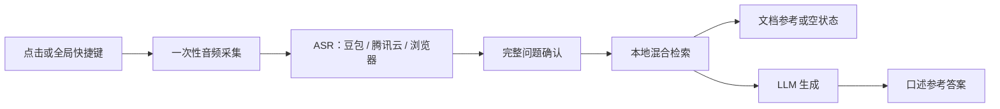

# 架构说明

## 产品边界

当前产品只保留“一次性识别问题”链路：用户主动点击或使用全局组合快捷键开始短时录音；停顿 3 秒或再次点击后提交完整转写。全程监听、声纹、说话人过滤及其配置均已移除。

## 代码职责

| 区域 | 职责 |
| --- | --- |
| `electron/` | 窗口、全局组合快捷键、一次性 ASR 会话和主进程 IPC。 |
| `app.js` | 渲染页状态、录音采集、资料管理、答案展示；不直接保存密钥。 |
| `server.js` | 本地 HTTP API 组合层：配置、文档、检索、LLM 与静态文件。 |
| `src/question-capture*` | 一次性录音的状态机、静默提交和切窗恢复决策。 |
| `src/asr-*`、`src/doubao-asr.js`、`src/tencent-asr.js` | ASR 服务适配与转写缓冲。 |
| `src/search.js`、`src/hybrid-retrieval.js`、`src/local-semantic-index.js` | Markdown 切分、本地关键词/语义混合召回。 |
| `src/answer-*.js`、`src/llm-*.js` | 问题范围判断、上下文预算、LLM 请求和流式输出。 |
| `src/*-store.js` | 本地持久化。 |

## 数据边界

桌面版启动时，`electron/main.js` 会设置 `INTERVIEW_DATA_DIR` 为 Electron 的 `userData` 目录。服务端据此保存：

- `asr-config.json`：语音服务、LLM、快捷键配置；
- `documents.json`：上传的 Markdown；
- `glossary.json` 与 `answer-rules.json`：术语和规则；
- `semantic-index.json`：本地检索索引。

源码根目录的 `.local/` 只作为非桌面模式和历史兼容回退，已被 Git 忽略。不要把用户资料或密钥写回源码目录。

## 稳定性规则

1. 新功能先加纯函数测试，再接入 Electron/DOM。
2. 录音会话只允许一个活跃实例；第二次触发按状态机提交或排队，不能静默覆盖上一题。
3. 切换窗口后仅检查并恢复当前采集图；不启动后台连续监听。
4. 没有可靠检索命中时必须返回空状态，不能复用上一题或强塞项目资料。
5. LLM 输入必须经过回答范围和上下文预算，项目经历、通用方法论、外部产品分析分开处理。

## 已移除的旧路径

已删除全程监听、浏览器连续识别、声纹样本录入、说话人过滤、旧音频工作线程及对应测试/样式。以后不得重新引入这些模块来影响一次性问题识别链路。
